# Lab 1 – Deploying, Exploring, and Exercising the Single-Tenant Monolith
Our transformation process must begin with our baseline monolithic application. We need a point of reference that employs common monolithic patterns that represent our starting point for migrating to microservices and multi-tenant SaaS. For our solution, we've picked a fairly common Java-based technology stack that should be similar to many of the monolithic solutions that have been commonly employed by different organizations. Although this example uses Java, there's little about this stack that is unique to Java. A .NET monolith, for example, would likely have a footprint very similar to what we have created.

The architecture of our monolith is based on a traditional EC2-based model where the web and application tiers of our system are hosted on a collection of load-balanced, scalable instances. While these web and application layers are logically separated within the code, they are deployed collectively as one monolithic unit. Any change to the web experience or the business logic would require a complete redeployment of the code. This is a classic monolithic challenge. Occasionally, we see the web tier separate from the application tier to allow separate scale and deployment, however, with server-side HTML rendering, this is not common. The data for each customer is stored in a single database that houses all of the system's data. The conceptual footprint of this environment is shown in the image below:

<p align="center">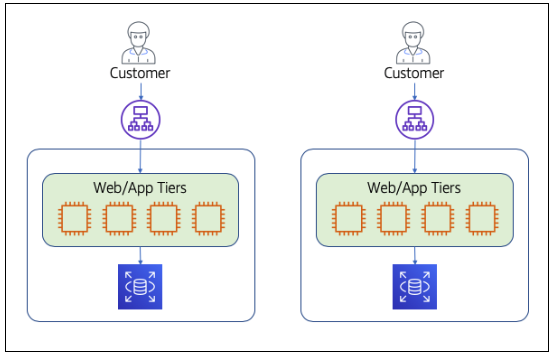</p>

You'll notice that we've shown two copies of this environment. This is to convey the idea that every customer of this monolithic system will be deployed into a complete standalone copy of the infrastructure. This is a common strategy for most single-tenant independent software vendors (ISVs). In these solutions, each customer has their own unique installation. This usually means separate support, potentially different versions, and different management and operations teams for each customer. 

Lab 1 starts with all the moving parts of this monolith provisioned. We'll look briefly at some of the key elements of the deployed architecture to give you a glimpse of the underlying components. We'll then exercise the monolith as a user might to demonstrate the working application and experience we'll be migrating to serverless microservices.

## What You'll Be Building

This lab is a mix of familiarizing yourself with both the underlying architecture as well as the simplified application of the monolith that we'll be migrating to a serverless, multi-tenant model. The following is a high-level breakdown of the steps that you will be performing in this lab:
*	Provision and explore the monolithic environment – at the outset of the lab, you'll have fully provisioned infrastructure to support the single-tenant starting point. You will set up your development environment, including an IDE, and trigger the CI/CD pipeline to deploy the monolithic application into the infrastructure. You will then be taken through some basic steps in the console to examine what has been provisioned.
*	Exercise the monolithic application – it's important to have some exposure to the application that is being transformed. We'll bring up the application and exercise a few aspects of it and look at the logs and data that are generated.
*	Examine the code of the monolith  - it is also important to expose you to enough of the implementation details of the monolith that you'll have a good reference as we begin to carve it up into microservices.

At the end of this lab, you'll still have a single-tenant, monolith experience. However, this first step sets the stage for our transformation of the application to a modern architecture.

## Step-By-Step Guide
The setup of this workshop provisioned all the supporting infrastructure for your Java-based, single-tenant monolith application. This includes the VPC and other networking and security components as well as the EC2 instances and the RDS database instances. To get started we need to get our Java application deployed to this infrastructure so we can begin to exercise its features. The following steps will guide your through this process.

<b>Step 1</b> – We want to simulate the developer experience as best we can, so we've started this lab with a baseline of infrastructure that has no application deployed. To get things moving, open the IDE that will be used throughout this workshop. We will use Amazon Cloud9 as our IDE for this workshop. To open Cloud9 search for the service in the AWS console, or find it listed under the Developer Tools category. 

Once you've opened the Cloud9 service, you'll see all the environments available to this account. An environment has been pre-provisioned for use throughout this workshop. On the AWS Cloud9 page you'll see <b>"Serverless SaaS Workshop IDE"</b> listed as one of the environments. Open this environment by selecting the <b>"Open IDE"</b> button.

<p align="center">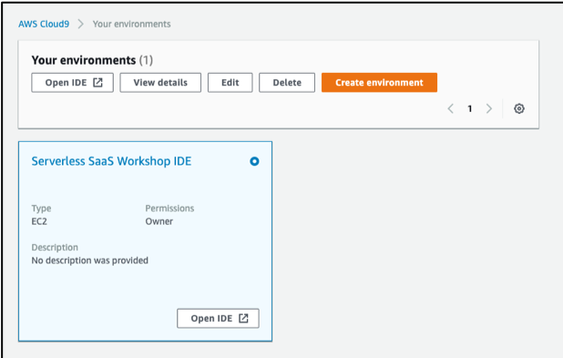</p>

The Cloud9 IDE has all the traditional elements you would expect to find in a modern IDE. Similar in layout to Eclipse, Visual Studio, VS Code and other popular IDEs, Cloud9 defaults to a file tree in a left-hand pane, a main editor pane in the center (which currently displays a welcome page), and an output pane at the bottom. This bottom window pane is an active Linux command-line shell which we will use throughout the workshop. The page will appear as follows:

<p align="center">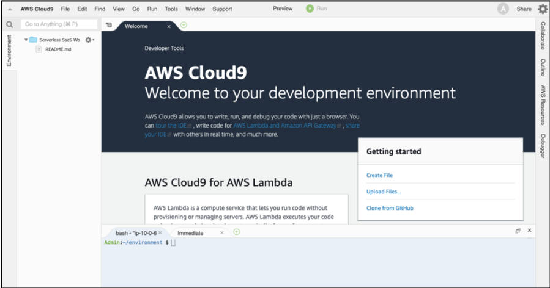</p>

<b>Step 2</b> – Now that Cloud9 is open, we can fetch our source code and build and deploy our applications. First, we need to bootstrap our Cloud9 instance by installing some dependencies and getting the code base set it up for you to use. We have configured a CI/CD pipeline using the AWS developer tools CodeCommit, CodeBuild, CodeDeploy and CodePipeline. This script will download a copy of the workshop source code and populate a local CodeCommit repository that we will be using as we apply changes during this workshop. Making changes to this repository will trigger the pipeline to build and deploy the application. Let's execute the bootstrap script with a cURL command. Place your cursor at the command line prompt in the lower window pane of Cloud9 and run the following command:

```
curl -s https://raw.githubusercontent.com/aws-samples/aws-saas-factory-serverless-workshop/master/resources/bootstrap.sh | bash
```

When this script is done executing, you'll have all the necessary pieces in place to begin exercising our application.

<b>Step 3</b> – The script committed a revision to the CodeCommit source control system, triggering a deployment. To see the status of this pipeline, navigate to the CodePipeline service within the AWS console. You'll see the <b>saas-factory-srvls-wrkshp-pipeline-lab1</b> pipeline listed amongst the pipelines in your account. The screen should appear as follows:

<p align="center">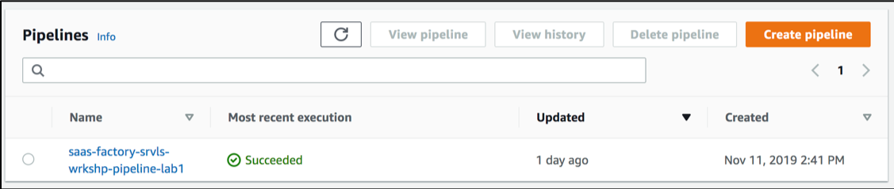</p>

Once this pipeline succeeds it will have deployed our monolith application to the infrastructure that was provisioned at the outset of this workshop. If you select the pipeline from the list, you'll be able to view the execution status of the pipeline. 


<b>Step 4</b> – While our code is being deployed, let's take a look at some of the infrastructure that will be hosting our application. The architecture that has been pre-provisioned for our monolith intentionally resembles something that could be on AWS now or on-prem. In this particular monolith solution, we have one layer of compute talking to one database. We have deployed this on an EC2 cluster in a multi-AZ configuration in an auto-scaling group. To see the current instances, navigate to the EC2 service within the AWS console. Now, select <b>Auto Scaling Groups</b> from the navigation pane on the left (you may need to scroll to locate the menu item). This will display a list of provisioned auto-scaling groups including one for Lab 1. Select the checkbox for this auto-scaling group. In the details at the bottom of the page, select the <b>Instances</b> tab to view the EC2 instances in the auto-scaling group. The screen should appear as follows:

<p align="center">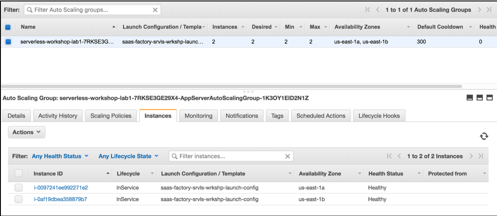</p>


This view shows that we have 2 running instances in our auto-scaling group. In a production environment, we'd likely provision a larger minimum footprint. These instances sit behind an Application Load Balancer (ALB) that directs traffic to each of the instances shown here.

<b>Step 5</b> – The infrastructure provisioned also includes an Aurora RDS cluster for our database. Navigate to RDS in the console and select <b>Databases</b> from the navigation pane on the left-hand side of the console. You'll see the <b>saas-factory-srvls-wrkshp-lab1-cluster</b> cluster and its instances. You will see other RDS clusters that we will utilize later on in the workshop. You can ignore those for now. The screen will appear as follows:

<p align="center">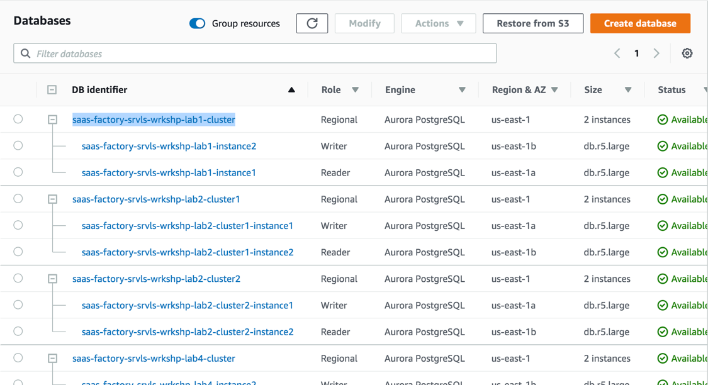</p>

This RDS cluster is deployed with separate reader and writer instances. As our monolith database it will hold all of the data for our entire single-tenant environment. As is normal for monolithic systems, all of the code in our application services has access to all of the tables and data in database. There is no separation of which business logic can access which segments of data.

<b>Step 6</b> – Now that we've see the compute and data layers of our supporting infrastructure, let's turn our attention to the running application. Before we can access the application, we'll first need to confirm that the deployment process has completed. Once again, navigate to CodePipeline in the console. Confirm <b>saas-factory-srvls-wrkshp-pipeline-lab1</b> shows Succeeded. 

<b>Step 7</b> – We need to locate the URL for our application. This is the domain name associated with the ALB which is routing requests to the EC2 instances in our target group. Navigate to the EC2 service in the AWS console. Select <b>Load Balancers</b> from the navigation pane on the left-hand side of the page. This will display a list of load balancers. Select <b>saas-wrkshp-lab1-[REGION]</b> from the list and your screen should appear as follows:

<p align="center">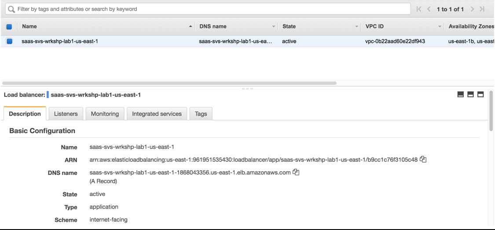</p>

In the description tab at the bottom of this page, the DNS name is listed under the ARN for the load balancer. Copy this DNS name and we'll use it to access the monolith application.

<b>Step 8</b> – Open a new tab or window in your browser and paste in the DNS name that we collected in the prior step as follows:

    http://saas-wrkshp-lab1-[REGION]-[RANDOM].[REGION].elb.amazonaws.com

This should open the landing page of our sample monolithic application that will appear as follows:

<p align="center">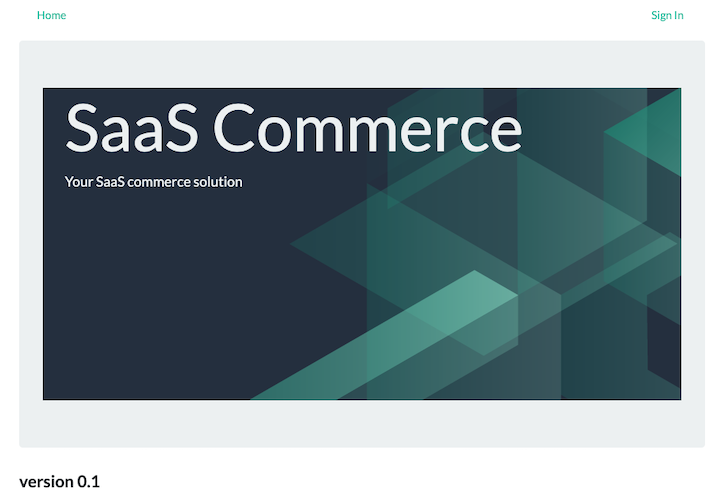</p>

<b>Step 9</b> – We can now begin to exercise the moving parts of our application. Start by logging in. Select the <b>Sign In</b> link at the top right of the page and you will be prompted with the following login form:

<p align="center"></p>

We created a user account for you as part of provisioning the workshop. You can login with the following credentials:
```
Email address: monolith_user@example.com
Password: Monolith123
```

<b>Step 10</b> – Once you land in the application, you'll see that our solution has some very basic functionality. The application that's been built was kept intentionally simple. Our goal is to focus more on the migration process and less on creating a fully functional reference application. The application mimics the functionality you might see in a e-commerce seller's platform. Sellers can manage their product catalog and view orders that have been placed by customers on some fictitious store frontend. Because we don't have a fake shopping site, we have a simple form to enter order data just so there is something to play with. The business logic of the system supports standard create, read, update and delete (CRUD) operations for products and orders along with a dashboard to view basic status information.

Let's start by adding a product. From the navigation options at the top of the page, select <b>Products</b> as shown below:

<p align="center">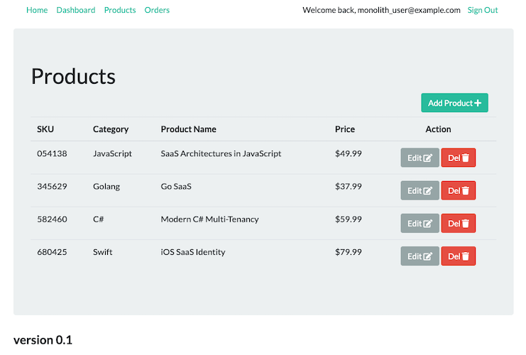</p>

On the products page you'll see some existing items listed. Select the <b>Add Product</b> button to enter a new product to the system. You should see the following form:

<p align="center">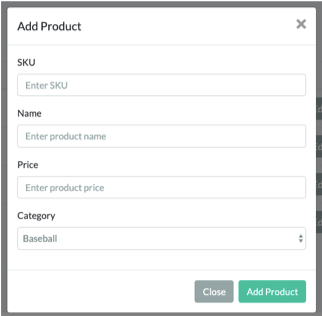</p>

Fill in the data for a sample product and click the <b>Add Product</b> button to save it. Repeat this process a few times to add a few additional products to the system.

<b>Step 11</b> – Now let's look at the code behind this monolith solution. We won't devote too much time to the monolith code since we're moving away from it, but it's helpful to have a bit more context and detail about the application that we're moving away from. This solution is built with Java, but the concepts here are similar to the patterns that appear in most monoliths. 

To explore the code, you must first re-open the Cloud9 service in the AWS console. Once you open the Cloud9, select the <b>Serverless SaaS Workshop IDE</b> that listed as one of the environments. Open this environment by selected the <b>Open IDE</b> button.

Now, expand the list of folders in the left-hand pane drilling into the <b>lab 1</b> folder. In that folder under <b>server</b> you'll find the <b>src</b> folder that holds the source code for our monolith. The main folders of our application are show in the following image:

<p align="center">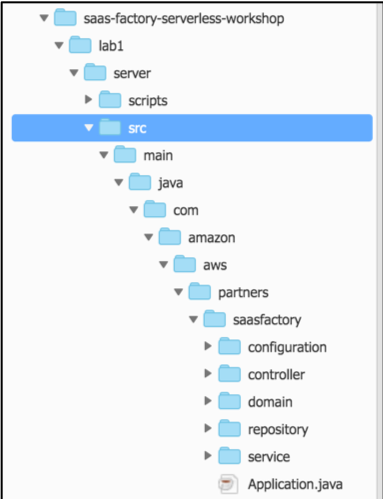</p>

You'll see a traditional Spring Boot project layout. The controller folder holds the code that is the entry point into your business services. It receives HTTP requests, coordinates running your backend service logic, and then triggers the rendering of the view. There are also domain objects that hold the representation of our data as it moves through the system. The repository folder holds the code needed to store and retrieve products and orders from the database. The service folder holds the actual business rules and implementation of our services. 

<b>Step 12</b> – Let's drill into one of the services by opening the service folder. Here you'll see the various product and order related files that implement our services. There are interfaces (<b>OrderService.java</b>, for example) and corresponding implementation files (<b>OrderServiceImpl.java</b>). Let's open the <b>OrderServiceImpl.java</b> file by double-clicking the file name in the left-hand pane. Below is a snippet of code from this file:

```java
@Autowired
private OrderDao orderDao;

@Override
public List<Order> getOrders() throws Exception {
    logger.info("OrderService::getOrders");
    StopWatch timer = new StopWatch();
    timer.start();
    List<Order> orders = orderDao.getOrders();
    timer.stop();
    logger.info("OrderService::getOrders exec" + timer.getTotalTimeMillis());
    return orders;
}

@Override
public Order getOrder(Integer orderId) throws Exception {
    logger.info("OrderService::getOrder" + orderId);
    StopWatch timer = new StopWatch();
    timer.start();
    Order order = orderDao.getOrder(orderId);
    timer.stop();
    logger.info("OrderService::getOrder exec" + timer.getTotalTimeMillis());
    return order;
}
```

These lines show a couple of methods of our Order service that process GET requests from the client. The first method processes request to get all orders and the second method gets a single order based on an order identifier. This is standard code that has no tenant awareness.

<b>Step 13</b> – The path into these services in the monolith relies on a Model View Controller (MVC) pattern that is commonly supported by frameworks that are used to build monolithic solutions. To get better sense for how requests are processed and pages are rendered in this MVC model, let's start with the UI of our application (the rendered "view" in our MVC model). 

Navigate to the application URL that we used above to access the application and sign in with the credentials that were provided. Now, select the "Products" item from the application menu and you will see a list of products.

<p align="center"></p>

Let's try deleting the _680425 Swift iOS SaaS Identity_ product from the catalog. Click the red delete <b>Del</b> icon that appears at the right-hand edge of the row displaying the fictitious iOS book. You will be prompted to confirm that you really want to delete this product:

<p align="center">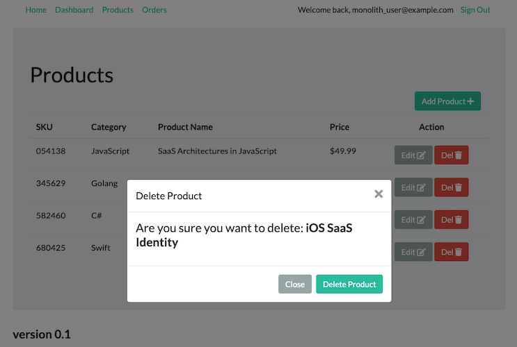</p>

Click on the <b>Delete Product</b> button. Oops! What happened? Why did we get a 404 error?

<p align="center">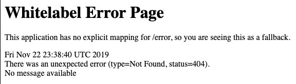</p>

<b>Step 14</b> – Let's troubleshoot our problem by digging into the "Controller" portion of our MVC model to see why our delete request isn't working. Navigate to the Cloud9 service and open the IDE for this workshop. With the source tree that appears on the left, navigate to the <b>lab1/server/src/main/java</b> folder. Within the nested folders (these correspond to Java's package naming organization of code), open the <b>controller</b> folder. This will give you a list of the controllers that are implemented for our monolith. Double click the <b>ProductsController.java</b> file to open the editor for this file. 

Within this file, we'll navigate to the <b>updateProduct()</b> and <b>deleteProduct()</b> methods of our Java class. These two methods represent the entry point of our HTTP calls that will be processed by the various methods in this class. You'll notice that, within the body of these methods, we are calling our ProductService that is the actual implementation of our business logic functionality. Let's take a closer look at these two specific methods to see if we can figure out what's broken with the delete product functionality that we observed in the application. The two methods are as follows:

```java
@PostMapping("/updateProduct")
public String updateProduct(@ModelAttribute Product product, Model model) throws Exception {
	LOGGER.info("ProductsController::updateProduct " + product);
	productService.saveProduct(product);
	return "redirect:/products";
}

public String deleteProduct(@ModelAttribute Product product) throws Exception {
	LOGGER.info("ProductsController::deleteProduct " + product.getId());
	productService.deleteProduct(product);
	return "redirect:/products";
}
```

At first glance, there doesn't appear to be anything wrong with the <b>deleteProduct()</b> method. However, if you compare it to the <b>updateProduct()</b> method above it, you'll notice that there is a <b>@PostMapping</b> annotation associated with our <b>updateProduct()</b> method. This annotation is missing from our <b>deleteProduct()</b> method. Without this annotation, the HTTP calls from the browser will have no route to the delete method.

To resolve this, we simply need to add the missing annotation to our <b>deleteProduct()</b> method. Do this by adding the annotation as shown below:

```java
@PostMapping("/deleteProduct")
public String deleteProduct(@ModelAttribute Product product) throws Exception {
    LOGGER.info("ProductsController::deleteProduct" + product.getId());
    productService.deleteProduct(product);
    return "redirect:/products";
}
```

<b>Step 15</b> – We now need to save the changes we've made to the file and deploy the updated version of our controller. Select the "Save All" option from the "File" menu in Cloud9. Then, issue the following commands from the terminal window of Cloud9 to commit our changes and fire off the deployment of our new version.
```
cd /home/ec2-user/environment/saas-factory-serverless-workshop/
git add .
git commit -m "Added annotation to deleteProduct"
git push
```
Committing this change will automatically cause the CodePipeline to trigger a build and deployment of the new product service that includes your changed function.

<b>Step 16</b> – Before we can access the application, we'll first need to confirm that the deployment process has completed. Once again, navigate to CodePipeline in the console. Confirm <b>saas-factory-srvls-wrkshp-pipeline-lab1</b> shows Succeeded. 

<b>Step 17</b> – Let's now verify that our change was applied. Open the application using the URL acquired above and login using the supplied credentials. Now, select the "Products" menu item and again attempt to delete the the _680425 Swift iOS SaaS Identity_ product from the catalog by selecting the delete "Del" button that is on the far right-hand side of the row. Assuming your change was applied correctly and the new version completed deployment, your product should now be deleted successfully.

<b>Step 18</b> – As a final step, we want to take a quick look at the web client for this application. While we won't dig into the code much here, we want to emphasize the fact our monolith is actually rendering and serving all the HTML for our solution from the server. This solution follows the classic MVC pattern. We are using a common Java templating library to represent the UI views of our application. As each request comes into a <b>C</b>ontroller, it is processed and populates <b>M</b>odel object(s) to pass to the <b>V</b>iew as page variables to render in the HTML. After manipulating the <b>M</b>odel, the <b>C</b>ontroller triggers the templating library which binds these model objects to templates to render the HTML <b>V</b>iew that is returned.

The nuances of the MVC framework are not essential here. The key here is to realize that our controller uses Java objects to represent our data and a templating framework to bind these objects to the templates —- all on the server side. To view a sample UI template, navigate to the Cloud9 service in the console and open the IDE for the workshop. Open the <b>lab1/server/src/main/resources</b> folder from the source tree on in the left-hand pane of the IDE. Then, open the <b>templates</b> folder and select the <b>products.html</b> template file by double-clicking on the file name. The following is a snippet from the <b>products.html</b> UI template file that gives you a sense of how the models are bound to templates:

<p align="center">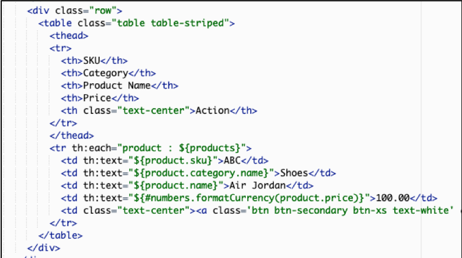</p>

This snippet represents the portion of the template that is used to populate this list of products in our table. You'll see that there is a for-each loop that wraps the &lt;tr&gt; table row tags and that the &lt;td&gt; tags for the data of our table cells include references to the product model object. For example, the first column resolves to the product SKU with the following syntax: <b>${product.sku}</b>. The end result here is that your request ends up serving up the HTML that is the binding of your HTML and your model object(s).

## Review

The goal of Lab 1 was to expose you to the fundamentals of the existing monolith. We reviewed the basic architecture of the monolith environment, acquired the code for our application, and deployed that code to our infrastructure. We then proceeded to exercise that code by running our monolith application. We also explored the underlying code of our monolith to highlight the classic MVC model that is used to build this solution, focusing in on the services and how they are wired up via a controller. In true monolith form, the application was entirely realized from a single unit of deployment. The web application and the supporting application services were all deployed as a unit to a cluster of EC2 instances. There was no awareness of tenancy in this environment whatsoever.

You have now completed Lab 1. 

[Continue to Lab 2](../lab2/README.md)
