# Lab 2 – Onboarding, Identity, and a Modern Client

Now that we have a fully deployed and functional monolith, it's time to start looking at what it will take to move this monolith to a multi-tenant, modern architecture. The first step in that process is to introduce a way to have tenants onboard to your system. This means moving away from the simple login mechanism we had with our monolith and introducing a way for tenants to follow an automated process that will allow us to sign-up and register as many tenants as we want. As part of this process, we'll also be introducing a mechanism for managing tenant identities. Finally, we'll also create a new client experience that extracts the client from our server-side web/app tier and moves it to S3 as a modern React application.

It's important to note that this workshop does not dive deep into the specifics of onboarding and identity. These topics could consume an entire workshop and we recommend that you leverage our other content on these topics to fill in the details. The same is true for the React client. Generally, there aren't many multi-tenant migration considerations that change your approach to building and hosting a React application on AWS. There are plenty of examples and resources that cover that topic. Our focus for this workshop is more on the microservices pieces of the migration and the strategies we'll employ with our onboarding automation to allow us to cutover gracefully from single-tenant to multi-tenant microservices.

Therefore, we will intentionally gloss over some of the details of onboarding, identity, and how we built our new React client and get into how our automated onboarding will orchestrate the creation of tenant resources. Here's a conceptual view of the architecture:

<p align="center">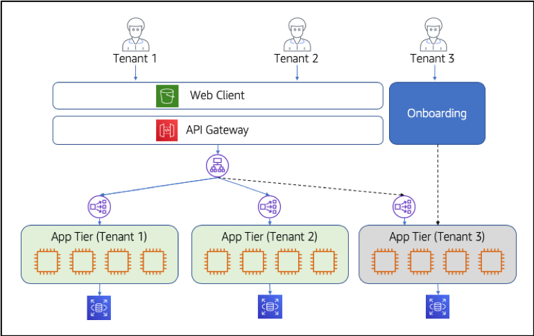</p>

You'll see that we now support a separate application tier for each tenant in your system, each of which has its own storage. This allows us to leave portions of our code in our monolith but be able to operate in a multi-tenant fashion. In this example, Tenant 1 and Tenant 2 are presumed to have already onboarded. Our new S3-hosted web application interacts with these tenant deployments via the API Gateway.

The challenge is that because every tenant will access the system through a shared web experience, we need to introduce some notion of routing that will direct requests per tenant to the appropriate silo of compute and database resources. This is achieved via Application Load Balancer (ALB) listener rules that inspect the headers of each incoming request, and route the traffic to the proper target group that is deployed separately for each registered tenant. 

As new tenants are added to the system we must provision a new instance of the application tier for this tenant (shown as Tenant 3 in the picture above). This automated process will both provision the new tier and configure the rules of the ALB to route traffic for Tenant 3 to this cluster.

Our goals for this lab are to enable this new onboarding automation and register some tenants to verify that the new resources are being allocated as we need. Again, we are only going to highlight the identity and underlying orchestration bits of this process, but we will dive deep on the request routing mechanics that makes this phase of our migration to multi-tenant microservices possible.

## What You'll Be Building

Before we can start to dig into decomposing our system into microservices, we must introduce the notion of tenancy into our environment. While it's tempting to focus on building new Lambda functions, we have to start by setting up the mechanisms that will be core to creating a new tenant, authenticating them, and connecting their tenant context to each authenticated user for this experience. 

A key part of this lab is deploying an onboarding mechanism that will establish the foundation we'll need to support the incremental migration of our system to a multi-tenant model. This means introducing automation that will orchestrate the creation of each new tenant silo and putting all the wiring in place to successfully route tenants, ideally without changing too much of our monolith to support this environment.

As preparation for decomposing our monolithic application tier into microservices, we will also move from an MVC page controller architecture to a REST API based architecture. By exposing our business logic services through a REST API, we start to see what our microservices will look like and we enable moving to a modern client-rendered web front end. We'll extract the UI from the server and replace it with a React application running in the browser. With this context as our backdrop, here are the core elements of this exercise:
*    Prepare the new infrastructure that's needed to enable the system to support separate silos for each tenant in the system. This will involve putting in new mechanisms that will leverage the tenant context we're injecting and route each tenant to their respective infrastructure stack.
*    Introduce onboarding and identity that will allow tenants to register, create a user identity in Cognito, and trigger the provisioning of a new separate stack for each tenant. This orchestration is at the core of enabling your first major step toward multi-tenancy, enabling you to introduce tenant context (as part of identity) and automation that configures and provisions the infrastructure to enable the system to run as a true siloed SaaS solution.
*    Refactor the application code of our solution to move away from the MVC model we had in Lab 1 and shift to a completely REST-based API for our services. This means converting the controllers we had in Lab 1 into an API and connecting that API to the API Gateway setting the stage for our service decomposition efforts.
*    Migrate from a server-side rendered UI to a modern React UI, moving the static JavaScript, CSS and HTML code to an S3 bucket and enabling us to align with best practices for fully isolating the UI from the server. This is a key part of our migration story since it narrows the scope of what is built, deployed, and served from the application tier.
*    Dig into the weeds of how the UI connects to the application services via the API Gateway. We'll find some broken code in our UI and reconnect it to the API Gateway to expose you to the new elements of our service integration.
*    Use our new UI to onboard new tenants and exercise the onboarding process. The goal here is to illustrate how we will provision new users and tenants. A key piece of this will involve the provisioning of a new application tier (still a monolith) for each tenant that onboards. This will allow us to have a SaaS system where each tenant is running in its own silo on largely "legacy" code while appearing to be a multi-tenant system to your end customers -- your tenants.

Once we complete these fundamental steps, we will have all the moving parts in place to look forward to Lab 3 where we start migrating our monolithic application tier to a series of serverless functions.

## Step-By-Step Guide

Starting Lab 2 you should have a good sense of the core elements of our monolith. It's time to start the modernization process. The steps below will guide you through the migration to a REST based API for our services which will support a new, modern UI. We will introduce multi-tenant onboarding, support for authentication with tenant context, and the automated provisioning of tenant application tiers.

<b>Step 1</b> – The first step in our migration to multi-tenancy is to introduce the core infrastructure that will enable us to have separate silos for each of our tenant environments. Our initial single-tenant system simply directed traffic through an ALB that routed _all_ traffic to a single stack for our one customer. However, to support multi-tenancy, we'll now have multiple instances of our stack and will need to put new routing infrastructure in front of these stacks to support this advanced architecture. 

To introduce these new constructs, we'll need to first execute a script that will use CloudFormation to configure the elements of this lab. Running the script will require you to navigate to the Cloud9 service in the AWS console and open the IDE for this workshop. Once the IDE is open, go to the terminal window in the lower window pane and run the following commands:
```
cd /home/ec2-user/environment/saas-factory-serverless-workshop/resources
sh lab2.sh
```

<b>Step 2</b> – Let's have a look at the status of the infrastructure deployment that we just kicked off. Navigate to the CloudFormation service within the AWS console. Locate the stack in the list that is contains <b>lab2</b> in its name. This stack is responsible for creating the infrastructure to support multi-tenancy including our new routing infrastructure. The screen should be similar to the following:

<p align="center">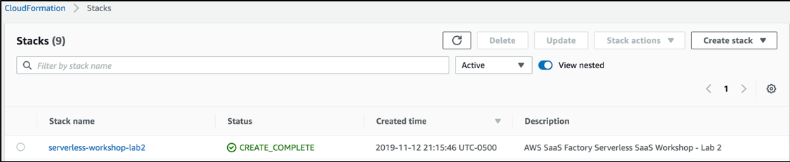</p>

We must wait until the stack has a status of <b>CREATE_COMPLETE</b>, indicating that all the elements of the stack have been created. If it is not complete, continue to select the refresh button (just to left of the Delete button at the top of the page) to get updated status. <b>You must wait for this process to finish before moving onto the next step</b>. The stack should take less than 5 minutes to complete.

<b>Step 3</b> – As part of moving to a multi-tenant environment, we've also opted to migrate our monolithic web UI (where all the HTML was rendered and served from the app server) to a modern UI framework that is served from Amazon S3 and executes in the user's browser. While this could be viewed as an optional step for many who are migrating to SaaS, we felt it was a compelling strategy and wanted to illustrate how making a move of this nature would influence the look of your final environment. The details of the React application that we'll deploy are mostly out of scope for this effort, but we encourage you to examine the code more carefully to understand how it interacts with the services of our environment. 

For now, our goal is to simply get this new UI deployed and working so we can begin to interact with our new multi-tenant model. To simplify things, we've created a shell script to build the React application and copy it to an S3 bucket to make it accessible. <b>You must ensure that the lab2 CloudFormation stack has completed successfully before continuing</b>. To run this script, navigate to your Cloud9 environment and enter the following commands to execute the web client deployment script:
```
cd /home/ec2-user/environment/saas-factory-serverless-workshop/resources
sh website-lab2.sh
```

<b>Step 4</b> – Now that our stack has been created, let's go look at the infrastructure we've introduce. In the new multi-tenant model we're building in this lab, each request that comes in from our React client will include the tenant context in a JWT token (we'll look deeper into how that works later in this lab). The API Gateway exposes our REST resources to client requests and manipulates the HTTP headers so the Application Load Balancer can route the requests to the appropriate tenant stack (silo). The first step in making this routing work is to construct the API Gateway and associate a custom authorizer with it that will extract our tenant context from the JWT token and expose it as part of the request context to the downstream resource the API Gateway proxies.

A custom authorizer is simply a Lambda function that is invoked with each request that is processed by the API Gateway. Within this Lambda function, we can inspect the incoming authorization token and inject context for downstream processing. To view the custom authorizer that was provisioned, navigate to the API Gateway in the AWS console. And select <b>saas-factory-srvls-wrkshp-lab2</b> from the list of APIs. Then, with this API selected, choose <b>Authorizers</b> from the menu of options displayed on the left. After you select this option, you'll see a page similar to the following:

<p align="center">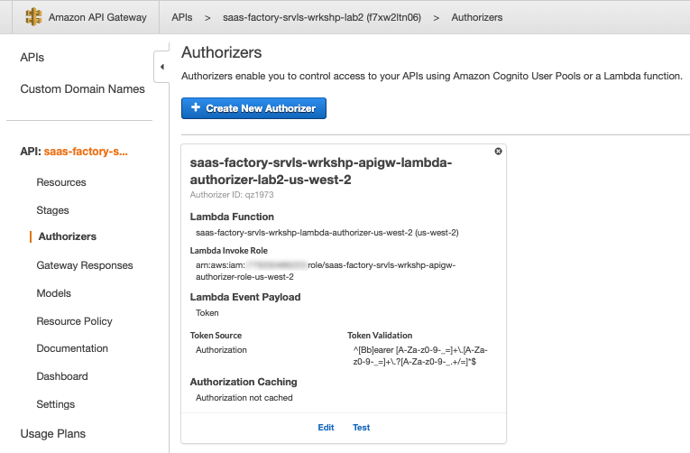</p>

You'll see that our authorizer expects an event payload of type <b>Token</b> and is associated with a specific Lambda function. In this case, our function is <b>saas-factory-srvls-wrkshp-lambda-authorizer-[REGION]</b>. Also note the <b>Token Source</b> is set to Authorization (more on this below).

<b>Step 5</b> – Time to dive deep on Lambda Authorizers! Let's open code for this Lambda function. Navigate back to Cloud9 and open the <b>Authorizer.java</b> file located in <b>resources/lambda-authorizer/src/main/java/com/amazon/aws/partners/saasfactory</b>

<p align="center">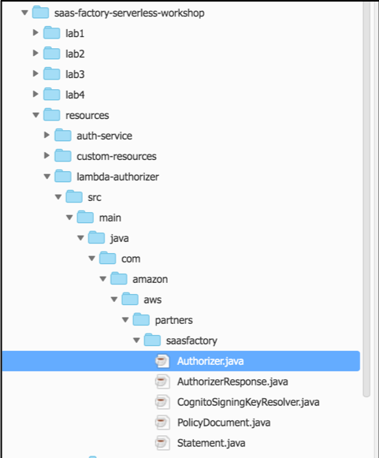</p>

Here's a snippet of code from that file:

<p align="center">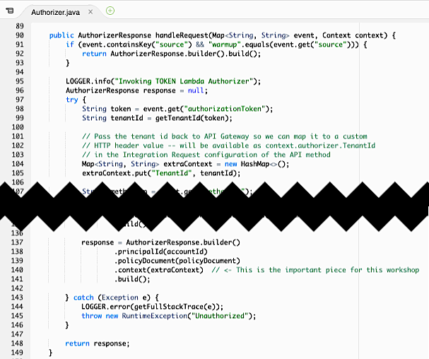</p>

Notice this is a normal Lambda request handler method. First, we parse the <b>authorizationToken</b> from the incoming <b>event</b>. The value of the authorizationToken is defined by the <b>Token Source</b> when you setup the authorizer for the API Gateway. We chose the <b>Authorization</b> header from the HTTP request which contains our signed JWT token. Once we have extracted the tenant identifier from the token, we add it to the <b>context</b> of the response object.

<b>Step 6</b> - Now that the Lambda Authorizer has extracted the tenant identifier from the signed JWT token in the HTTP Authorization header and passed it along to the API Gateway as part of the request context, we can map that value to a resource method's <b>Integration Request</b>. Let's take a look at how we do that. Go back to the Amazon API Gateway console, select the <b>saas-factory-srvls-wrkshp-lab2</b> API and then select <b>Resources</b> from the left-hand menu. Now click on the <b>GET</b> method listed under the <b>/products</b> resource. Your screen should look similar to this:

<p align="center">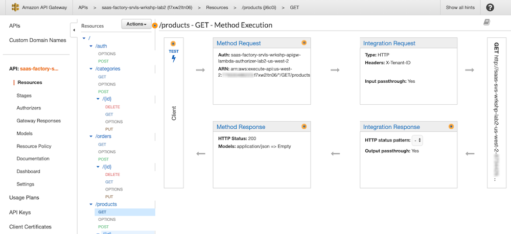</p>

Now, click on the blue <b>Integration Request</b> in the upper right of the 4 phases of the API method execution settings. Expand the caret/triangle next to <b>HTTP Headers</b> and you'll see that we've added a custom header named <b>X-Tenant-ID</b> and set its value as mapped from <b>context.authorizer.TenantId</b>. This is the TenantId property we set on the AuthorizerResponse object in our Lambda function.

 <p align="center">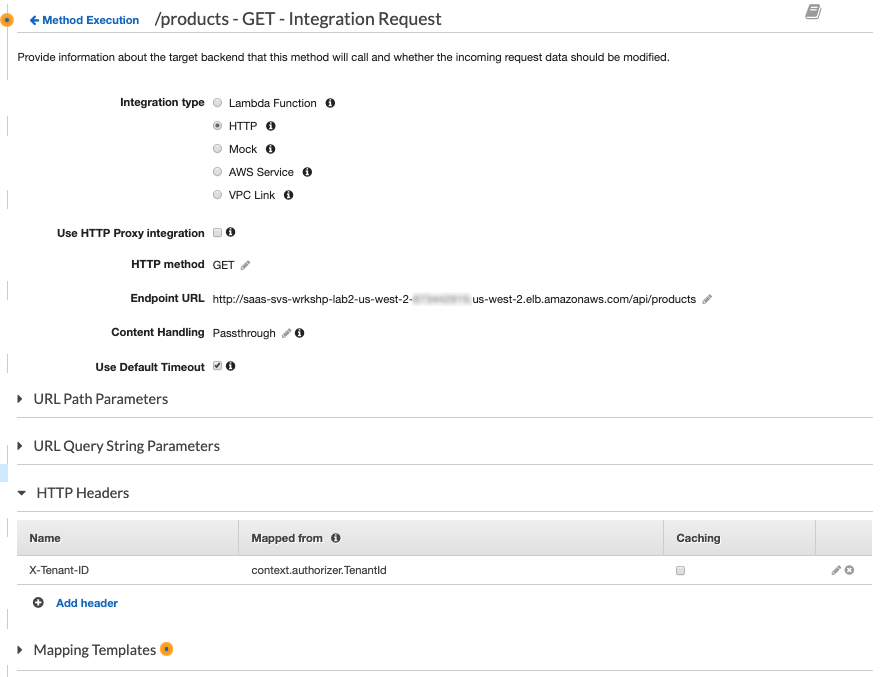</p>

<b>Step 7</b> – Now that we have our API Gateway injecting the header, the next piece to look at is the ALB which will be using this header to route traffic to each of our stacks. To view the ALB that was provisioned for our environment, navigate to the EC2 service in the AWS console and select the <b>Load Balancers</b> item from the menu on the left of the page (you may have to scroll down to find this menu item). The next step is to locate the ALB in the list of ALBs. Select the box next to the <b>saas-wrkshp-lab2-[REGION]</b>. The page should appear similar to the following:

<p align="center">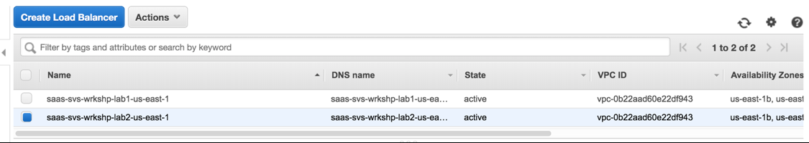</p>

With this item selected you can select the <b>Listeners</b> tab in the lower section of the page to view the listeners associated with this ALB. There is a single listener defined for our load balancer. It is listening for incoming HTTP requests on port 80. Click on the <b>View/edit rules</b> link in the right-most column of the listeners table. Now, the expectation here is that we would have seen routing rules in this listener list that would apply the <b>X-Tenant-ID</b> header we injected in the API Gateway to route traffic to the appropriate target group. However, there is only a default rule returning an HTTP 401 Unauthorized status for any request to this ALB. Why is that? It's because we haven't actually registered any tenants yet. An ALB must have at least one listener and a listener must have, at a minimum, a default rule. We have added an unauthorized rule to protect our system. The custom routing rules for our multi-tenant architecture only get added during the provisioning of each new tenant silo. We'll circle back here after we provision some tenants to see how that changes the configuration of our ALB.

<b>Step 8</b> – Before we can use our new React UI, we'll need a new URL to use for accessing our application (since it is now hosted on S3 and not served from the application server). To find the URL of the application, you'll need to navigate to the CloudFront service in the AWS console. This page will show a list of distributions. You should see a distribution listed with the origin value of <b>[StackID]-lab1-[RANDOM]-websitebucket-[RANDOM].s3-website-[REGION].amazonaws.com</b>. Copy the <b>Domain Name</b> value. You'll want to make note of this value, since it will be used throughout the remainder of this workshop to access the client application.

<p align="center">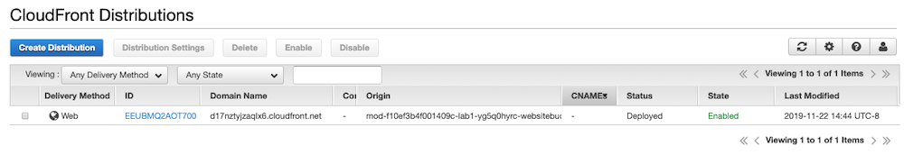</p>

<b>Step 9</b> – Now that we have the URL, we can access the application and verify that it works. Enter the URL we captured from the prior step and open the application. Our new React client is up and running and being served from S3 and cached at global edge locations by CloudFront. When the application opens it will appear as follows:

<p align="center"></p>

This page looks remarkably like the application from the monolith solution that was used in Lab 1. While they look similar, in the real-world scenario, you'd likely redesign aspects of your UI during the rewrite with a modern UI framework. 

<b>Step 10</b> – With this new multi-tenant environment, we can no longer simply sign-in to the system. As a SaaS system, we now onboard our tenants by having them complete a registration process. This is an important step in thinking about your migration. With this registration process, we are essentially presenting our system to end users as a fully SaaS system. This represents a key milestone in your migration approach, enabling your old monolith to run largely unchanged while providing the foundation for migrating the underlying implementation without users being aware of the shift to a multi-tenant serverless implementation. 

Let's create our first tenant by selecting the "Sign Up" button at the top right of our application. Upon selecting this option, you'll be presented with a form similar to the following:

<p align="center">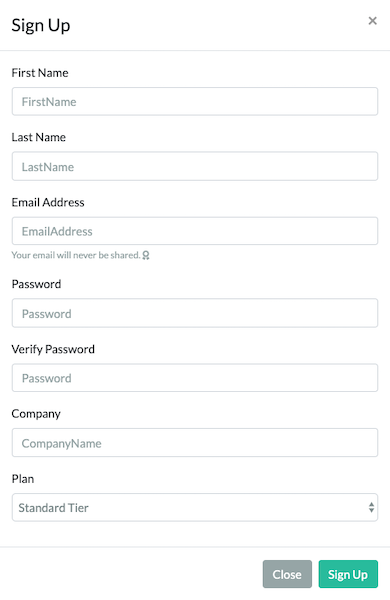</p>

Enter the values for your tenant and your tenant's first user (you do _not_ have to use a real email address for this workshop). This page is meant to be a bit of a simplified SaaS registration page, collecting common attributes that might be collected as new tenants onboard. If your organization doesn't support direct registration, you should still have internal automated tooling that would be collected and used to trigger onboarding. Please make sure to take a note of the email address and password you are providing.

<b>Step 11</b> - The registration form triggers a series of steps orchestrated by a Registration Service. A CloudFormation stack has been launched to onboard the new tenant. Verify the status of the stack by navigating to CloudFormation in the console and see the stack being created. This stack will take a few minutes to provision all of the siloed infrastructure for your new tenant. <b>You must wait for this stack to complete before proceeding</b>.

<p align="center"><kbd>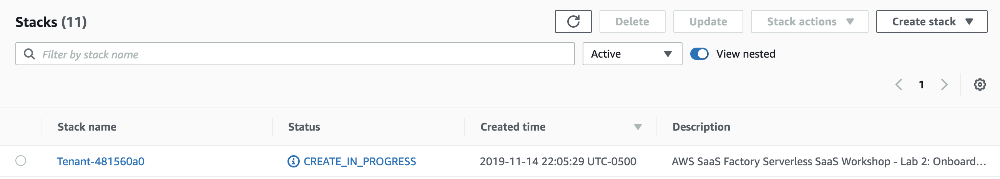</kbd></p>

<b>Step 12</b> - Just as in Lab 1, we need to trigger the CI/CD pipeline to deploy our monolith to the silo of infrastructure created for your new tenant. Navigate to CodePipeline and click on the <b>saas-factory-srvls-wrkshp-pipeline-lab2</b> pipeline. This pipeline will be in failed state as of now. Clicking on the pipeline will take us to details page as below. Click on the orange <b>Release Change</b> button to launch the pipeline. <b>You must wait for all 3 phases of the pipeline to finish successfully before continuing</b>.

<p align="center"><kbd>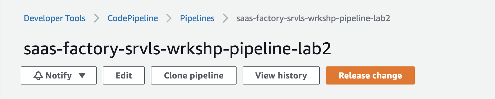</kbd></p>

<b>Step 13</b> - Once the pipeline has completed successfully, our new tenant is fully onboarded into their own stack! Let's go back to our client web application hosted at the CloudFront domain name you captured above and sign in using the email and password which you used during the registration process. Click on <b>Sign In</b> button on top right corner and enter your login details. Click on <b>Sign In</b> to authenticate into the application. 

<p align="center"><kbd>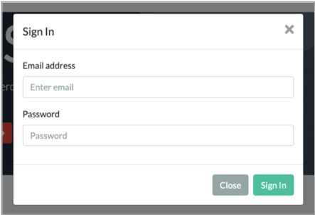</kbd></p>

<b> Step 14</b> – Once you're in the application, you will land on the dashboard page (just like the monolith experience in Lab 1) that is a placeholder for providing analytics about your ecommerce business. The page also has a navigation bar at the top to access the various capabilities of the application. The page will appear as follows:

<p align="center">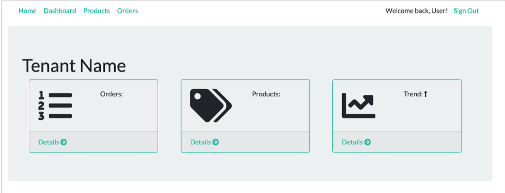</p>

<b>Step 15</b> – Now, let's access the product page by selecting the <b>Products</b> item from the navigation at the top of the page. The page will be empty because this tenant has just registered and hasn't added any products to their catalog. The screen will appear as follows:

<p align="center"><kbd>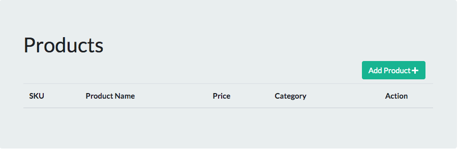</kbd></p>

<b>Step 16</b> – Click the <b>Add Product</b> button to create a new product. Upon selecting this option, you will be presented with a form to enter the product information that appears as follows:

<p align="center">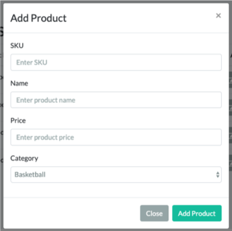</p>

Just as you did in Lab 1, enter some product information and select <b>Add Product</b> to save your product information. This will return you to the list of products where you will be able to see that your new product was added. Make sure to add at least two products, because we will need them in Lab 3.

<p align="center">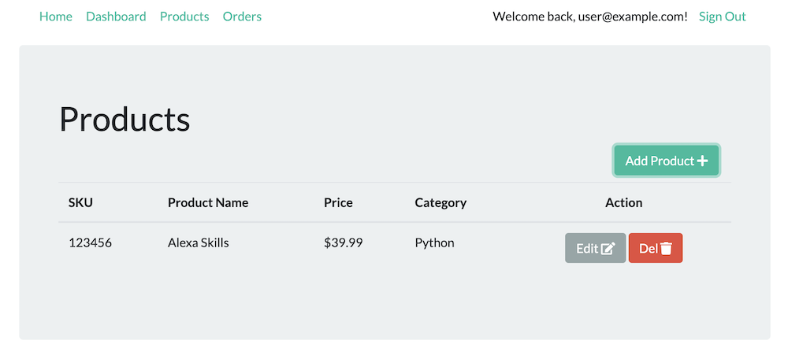</p>

<b>Step 17</b> – Now that we've successfully added a tenant and some products to our system, we can take a closer look at what the system provisioned for each tenant and how the routing was configured to direct individual tenants to their respective silos. We'll start this process by looking at how our tenant was provisioned into Amazon Cognito (which authenticates users and provides the essential JWT token that controls the flow of tenants through the system).

Navigate to the Cognito service within the AWS console. In this example, we're provisioning a separate user pool for each tenant. These pools let us group and configure policies separately for each tenant. Select <b>Manage User Pools</b> from the landing page and you'll be presented with a list of user pools similar to the following:

<p align="center">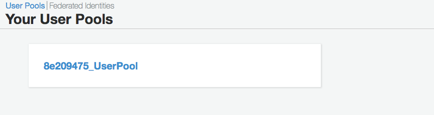</p>

Each time you add a new tenant to the system, a new Cognito User Pool will be created. At this point, you should have only one pool since we've only added one tenant. Select that pool from the user pool page. This will provide you with a summary of the pool configuration. Now, select <b>Users and groups</b> from the left-hand side of the page to view users that currently reside in this pool. The page will appear as follows:

<p align="center">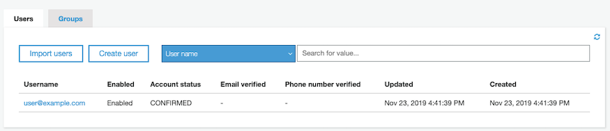</p>

Listed here will be the user that you registered when you created your tenant. Select the link for your user name to view the attributes of the user you created. A page similar to the following will appear:

<p align="center">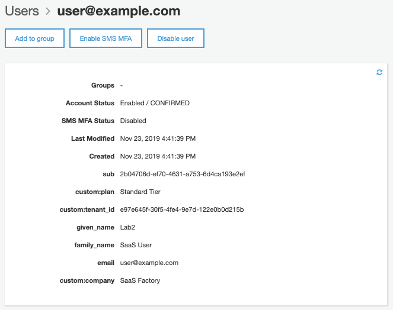</p>

When we provisioned the tenant user pool, we configured specific attributes that allow us to track this user's relationship to a specific tenant. This is shown as the <b>custom:tenant_id</b> custom attribute for the user. This tenant identifier will now be included in the JWT token that is returned from your authentication experience and will be passed through as part of all our interactions with downstream services.

<b>Step 18</b> – So, we have a tenant identifier embedded in our JWT token and we've seen how the API Gateway custom authorizer will inject tenant context. However, if you recall, when we looked at the ALB it did not have a routing rule for our tenant because we hadn't onboarded any yet. Now we do have a tenant and we can return to see how the ALB was configured to support the routing for this new tenant. To view this new information, navigate to the EC2 service in the AWS console and select <b>Load Balancers</b> from the left-hand side of the page (you may have to scroll down some to find it). This will provide you with a list of load balancer similar to the following:

<p align="center"></p>

Select the <b>saas-wrkshp-lab2-[REGION]</b> load balancer from the list. Now, scroll down the page and select the <b>Listeners</b> tab for the ALB. Click on the <b>View/edit rules</b> link and you'll now see a rule has been added specifically for our tenant to control routing. Note that this forwarding rule is set to a higher priority than the default 401 unauthorized rule. The screen will appear similar to the following:

<p align="center">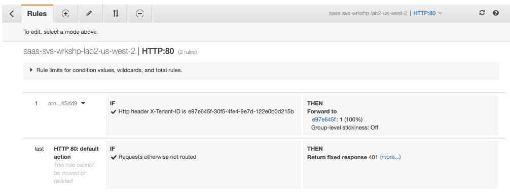</p>

This rule examines the value of the X-Tenant-ID header we inserted via our custom authorizer and forwards traffic to the target group for that tenant's stack of infrastructure. As each new tenant is added, a new rule will be introduced in this list.

<b>Step 19</b> – In addition to configuring the routing, the onboarding process also provisioned a separate, siloed set of compute resources for each tenant. This cluster of auto-scaled instances continue to run the application services portion of our system. If we look closely at the EC2 instances and databases, you'll find there are separate instances and a separate database provisioned for each tenant. We won't dig into this too deeply. However, it's a critical element of this model that enables our future incremental move to microservices.

Let's take a quick look at the EC2 resources that we currently have to get a better sense of what was created. Navigate to the EC2 service in the console and select the <b>Instances</b> option from the menu on the left-hand side of the page. In this list of instances, you'll see instances with the name <b>saas-factory-srvls-wrkshp-lab2-[TENANT_ID]</b> that represent the instances that were provisioned for your new tenant. If you onboard another tenant, you'd see more instances added here to support that tenant.

<p align="center">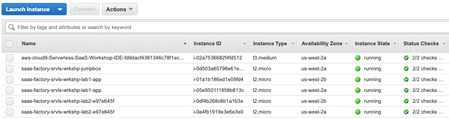</p>

<b>Step 20</b> – Now that you see how the infrastructure and onboarding have changed to support our multi-tenant model, let's look at how the new React client, the API Gateway, and the proxied application services in the tenant silos all connect together. Let's go back to the web client using the CloudFront URL you captured above and sign in with the email address and password you used to register your new tenant.

Once you've logged in, you'll land on the dashboard home page. Click on the <b>Products</b> link in the navigation header to go to the product catalog listing page. Your list of products may be empty. Add a couple of products to your catalog.

Now, delete a product by selecting the red <b>Del</b> icon on the right hand side of the row of the product you'd like to remove. You will see a confirmation dialog asking if you really want to delete your product. Click on the <b>Delete Product</b> button. Nothing happens! Why? Time to debug.

<b>Step 21</b> - Let's start our trace from the client to the server by looking at some code in the React application. To get to this code, you'll need to open Cloud9 in the AWS console again and open the IDE environment for this workshop. Open the <b>lab2/client/src/components/products/actions</b> folder in the navigation pane on the left. Double-click on the <b>index.js</b> file to view its contents. In this file you'll find a <b>deleteProduct</b> function toward the bottom that appears as follows:

```javascript
export const deleteProduct = (product) => {
   return function(dispatch) {
       const url = `/products/${product.id}`;
       const instance = createAxiosInstance();
        
        dispatch(closeModal());
        
        /*
        instance.delete(url, { data: product })
            .then(response => {
                const deletedProduct = response.data;
                if (deletedProduct && deletedProduct.id) {
                    dispatch(deleteProductFinished(deletedProduct));
                } else {
                    dispatch(errorModal("The product was not deleted."));
                }
            }, error => console.error(error))
            .then(() => {
            }, error => console.error(error));
        */
   };
};
```

This function is called whenever the client indicates that they want to invoke the DELETE REST method of the Product service. You'll see here that the actual invocation of this method has been disabled. We'll need to un-comment the block of code that makes the call as the first step in repairing this broken path in our application. Remove the comment markers and save the file with the Ctrl-S keyboard shortcut, or by choosing <b>Save</b> from the <b>File</b> menu in Cloud9.

<b>Step 22</b> – Now that we've repaired our client code, we'll need to re-deploy our changes to S3 to have them applied. With the Cloud9 IDE, navigate to the terminal window and executed the following command to re-deploy our client:
```
cd /home/ec2-user/environment/saas-factory-serverless-workshop/resources
sh website-lab2.sh
```

Because we had previously deployed our client application, CloudFront has cached a copy of the JavaScript in its edge locations. We must wait for the CloudFront distribution cache to be cleared before we can continue. Navigate to the CloudFront service in the console and find the distribution just as you did earlier in this lab. The distribution origin will follow the pattern <b>[StackID]-lab1-[RANDOM]-websitebucket-[RANDOM].s3-website-[REGION].amazonaws.com</b>. Click on the distribution and then click on the <b>Invalidations</b> tab. Wait until the listed invalidation shows a <b>Status</b> of <b>Completed</b>.

<p align="center">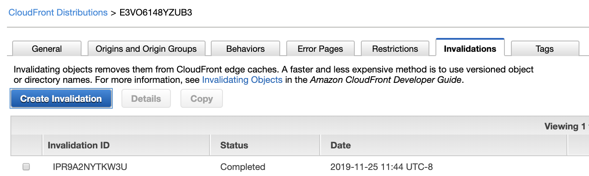</p>

<b>Step 23</b> – Now, let's navigate back to the application and attempt to delete the product again (using the URL and credentials we used above). Be sure to <b><i>refresh your web browser</i></b> to force it to pull down a fresh copy of the JavaScript you just fixed. Our updates now have the React client submitting our delete action. However, despite our changes, delete is still not working.

<p align="center">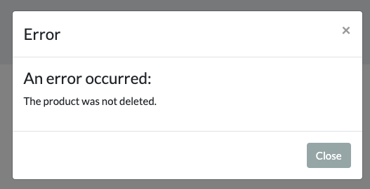</p>

This is because the API Gateway is still not wired to connect to our application tier services. To resolve this, we'll need to open the API Gateway service in the console and select the <b>saas-factory-srvls-wrkshp-lab2</b> API from the list. This will display the various resources that define our system's REST API. In the list of resources, find the <b>/products</b> resource as follows:

<p align="center">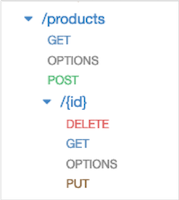</p>

To resolve our issue, we need to repair the DELETE method for this resource. Select DELETE to configure this method.

<b>Step 24</b> – Once you've selected DELETE, you see the details of the method configuration in a screen that appears as follows:

<p align="center">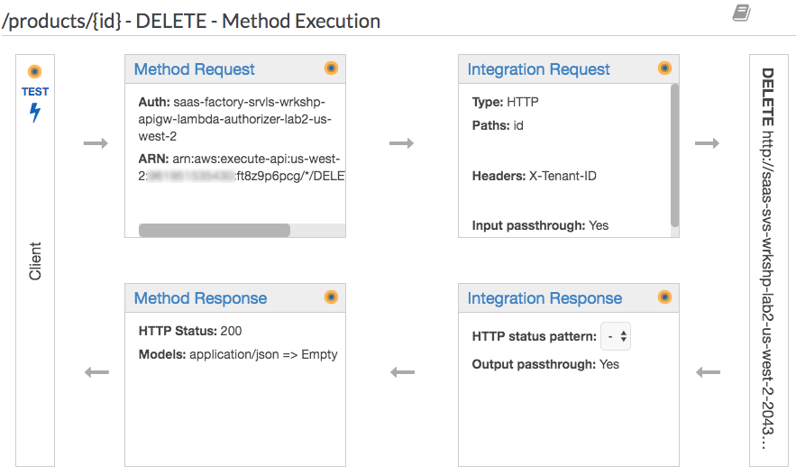</p>

<b>Step 25</b> – From here, click <b>Integration Request</b> at the top of the box that appears at the right. The integration request configures the mapping for our DELETE method. When you choose this option, you will see a screen similar to following:

<p align="center">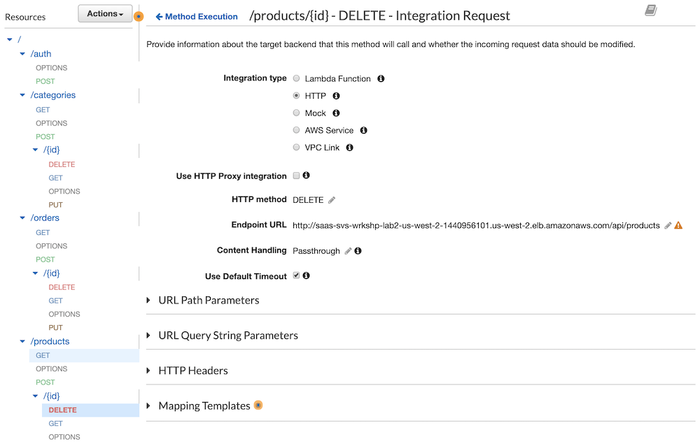</p>

You may notice a warning icon next to the <b>Endpoint URL</b>. It turns out, our endpoint URL is missing a key qualifier. Select the pencil icon next to the Endpoint URL to edit the value. Append the <b>/{id}</b> path variable to your endpoint and <b>select the small checkmark icon</b> to save the value.

<p align="center">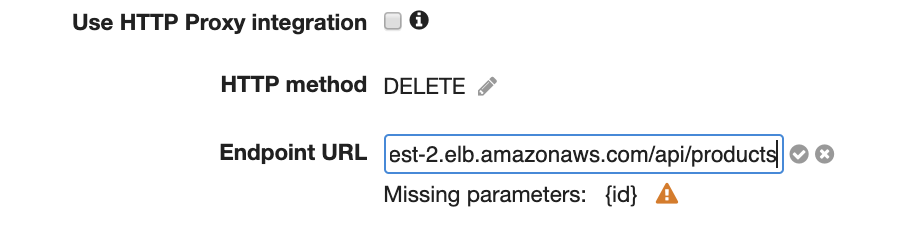</p>

Now that our Endpoint URL has a placeholder for the path variable (the product id), we need to tell API Gateway how to map that to the request so it gets properly passed along to our backend application tier. Expand the <b>URL Path Parameters</b> section by clicking on the caret/triangle. Click on the <b>Add path</b> link and enter <b>id</b> for the <b>Name</b> of your parameter and <b>method.request.path.id</b> for the <b>Mapped from</b> value. Be sure to <b>select the small checkmark icon</b> to save your changes. This should have repaired the last broken piece of the puzzle.

<p align="center">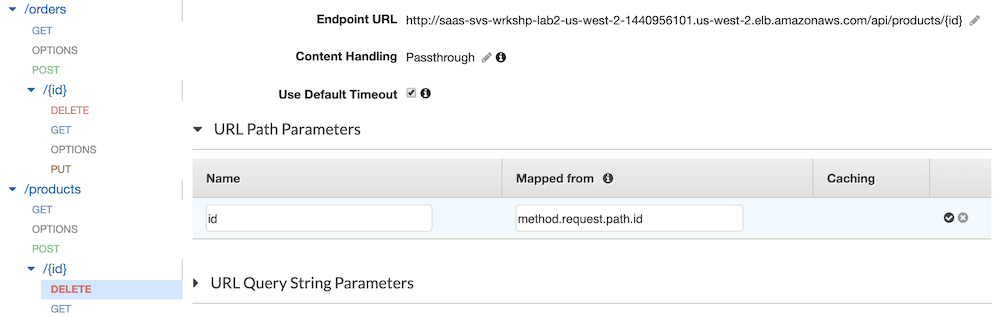</p>

<b>Step 26</b> - Before we can see our fix in action, we must redeploy our API. At the top of the screen, above the list of resources, select <b>Deploy API</b> from the <b>Actions</b> drop down menu.

<p align="center">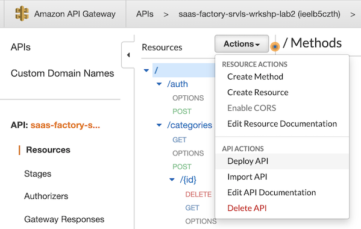</p>

Select <b>v1</b> for the <b>Deployment stage</b> and click the <b>Deploy</b> button.

<p align="center">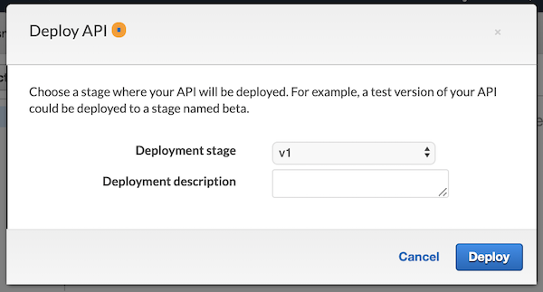</p>

<b>Step 27</b> – To validate that our change worked, return to the serverless client application (using the URL from above) and sign in with the provided credentials. Now, attempt to delete the product and you should find that our change has resolved the issue.

<b>Step 28</b> – Finally, we should also note how this move to the API Gateway and a new UI model influenced the implementation of our application service. While our goal is to minimize changes to the monolith code, the interaction between the client and the monolith did change from an MVC model to a REST-based API. That meant that the controller portion of our MVC needed to be refactored to expose the REST API that is invoked through the API Gateway. 

To view these changes, navigate to the Cloud9 services in the AWS console and open the IDE for this workshop. In the left-hand pane, open the <b>lab2/server/src/main/java</b> folder. This will open a series of folders that correspond to the Java package naming. Under the <b>saasfactory</b> folder you'll see an <b>api</b> folder that holds the new REST API for our services. Double-click on the <b>Products.java</b> file to open the API in the editor. The following is a snippet of code from this file:

```java
@CrossOrigin
@GetMapping(path = "/products/{id}")
public Product getProduct(@PathVariable Integer id) throws Exception {
    logger.info("Products::getProduct id = " + id);
    return productService.getProduct(id);
}

@CrossOrigin
@GetMapping(path = "/products")
public List<Product> getProducts() throws Exception {
    logger.info("Products::getProducts");
    return productService.getProducts();
}
```

While this code does have similarities to the code from our controller, you'll notice here that we've introduced annotations that declare our REST API entry points. Just like our page controllers, this code delegates to the business logic in our service classes, but now instead of integrating with an HTML templating framework, these methods return JSON strings to the client which now assumes responsibility for rendering the HTML. You'll also notice that we no longer need the controller classes or the HTML templates from the resources folder.

## Review

While it may not feel as though we've done much to enable migration to our serverless SaaS microservices, the work done in Lab 2 is one of the most fundamental bits of plumbing that has to get put into place to enable you to start thinking about carving out individual microservices.

With Lab 2, we put all the pieces of multi-tenancy in place without making huge changes to our monolithic application. We introduced onboarding and identity to enable tenant context to get introduced into our environment. We also created all the automated provisioning to create siloed instances of our monolith for each tenant with separate computing and storage for each tenant.

At the core of all this was a routing experience that enabled our system to route calls from our client to each tenant stack. Finally, we also made the move to a modern UI model, introducing a React application that is served up from S3. By extracting and committing to this new client model, we streamline and focus our efforts as we look to start creating serverless microservices. This prevents our services from being cluttered with worrying about server-rendered HTML.

You have now completed Lab 2. 

[Continue to Lab 3](../lab3/README.md)