# Lab 3 – Carving Out Our First Multi-Tenant Serverless Microservice

Now that we have an automated onboarding process and multi-tenant identity in place, we can start to focus more of our energy on decomposing our monolith into multi-tenant microservices. Our goal is to carve out individual services from our monolith, slowly extracting functionality from the monolith and to come up with mechanisms that enable some of our application to remain in the monolith while other bits of it are running as true multi-tenant serverless microservices.

A key part of this strategy is to support a routing scheme that enables side-by-side execution of the microservice and monolith services. The idea here is that we will have a single unified API for our services that will then route traffic to the appropriate target service (a Lambda function or an entry point in our monolith). The following diagram provides a conceptual view of the approach we'll be taking to carving out this first service.

<p align="center">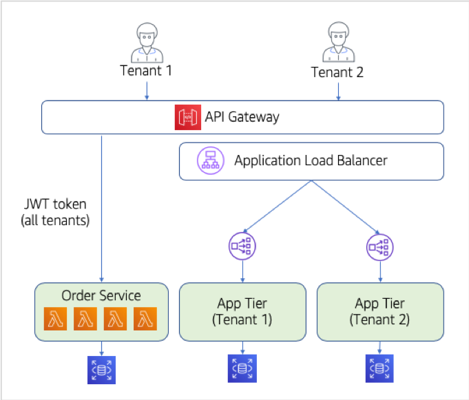</p>

In this diagram, you'll notice now that we have two separate paths for our tenants. As tenants enter the API Gateway, they can either be routed to our new Order service, or they can be routed to the monolith application tier. It's important to note that the flows will be different if you are consuming the new microservices (Lambda functions) or the application tier. Since our Order service is a pooled multi-tenant service, it will process requests for all tenants. Meanwhile, the monolith will still require a separate deployment for each tenant. This means our siloed monoliths will also require the routing rules to direct traffic to the appropriate application tier (using Application Load Balancer routing rules). 

In this lab we will enable the conceptual view you see above. We'll introduce and deploy our new multi-tenant Order service in a serverless model. We've stayed with Java as the language for the individual functions of our Order service. However, you could imagine that a migration to a serverless model might also involve a switch in languages. There are a wide range of factors that could influence your choice. For this exercise though, it seemed to make sense to stick with one language to make it easier to follow the transition from monolith to serverless.

Generally, as we've broken services out of our monolith, we're trying to create a class file that represents a logical microservice. The idea here is that, just like our "service" layer code from the monolith, we'll still have a class with the different methods of our solution. We will then deploy the different methods of our class as individual Lambda functions. This model makes it easy for us to move our code over from the monolith without major changes. However, this is only the case because we already had a clear notion of services in our monolith. In many cases, the monolith will not break apart so cleanly. We also have to begin to leverage the tenant context that flows into this service, using it to partition data, add logging context, and so on.

We should note that this migration will not dig into the details of the data migration aspects of this problem. While these are an important part of the broader migration story, they are considered out of scope for this effort. So, as we carve out our new services and introduce new multi-tenant storage constructs, we'll be starting with a blank slate (leaving whatever data exists behind in the monolith database).

## What You'll Be Building

This lab is all about getting our first service carved out of our application tier. We'll focus on looking at what it means to build a serverless version of this service. This also means looking into how the service is deployed and configured within our infrastructure to support the model described above. The following is a breakdown of the key elements of the lab:
*	Our first step will be to actually create the Lambda functions that makeup our Order service. We'll review how our Java gets converted to a function-based approach and describe the basic exercise of getting these new functions deployed.
*	The API Gateway will also require changes to support our new functions (along with the monolith tier). We'll look at how the API Gateway will route specific Order service calls to the Lambda functions in our service and connect the dots between the development experience and the run-time environment.
*	As part of extracting the order service, we must also think about how our data will be represented in a multi-tenant model. More specifically, we'll need to pick a storage technology that best fits the isolation, performance, and scale needs of the Order service and introduce a data partitioning scheme.
Upon completion of these steps, you should be well on your way to a full serverless SaaS model. With one service migrated, you can now begin to think about how you would carve out the remaining services from the application tier. We look forward to that exercise in Lab 4.

## Step-By-Step Guide

The following is a breakdown of the step-by-step process for getting our new multi-tenant Order service deployed in a serverless model.

<b>Step 1</b> – Let's start by finding the code that will start with for our Order service. Open the Cloud9 IDE in the AWS console and select the <b>Serverless SaaS Workshop IDE</b>. With the IDE, we can now examine the code that currently exists for our Order service. To get there, open the <b>lab3</b> folder in the left-hand pane of the page. Under the <b>order-service/src/main/java</b> you will find the various Java files that makeup our Order service. Double click <b>OrderService.java</b> to open it in the editor window. Here's a snippet of that file:

<p align="center">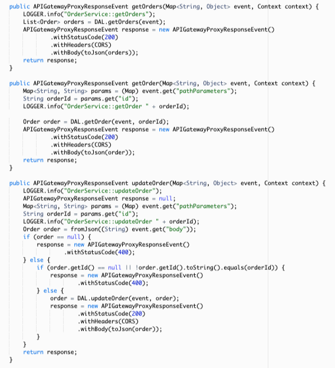</p>

This class contains a series of Lambda function event handlers which corresponde to the CRUD operations of our Order Service.

<b>Step 2</b> - Let's deploy this new microservice and see it in action. We've introduced a script that will be responsible for uploading and publishing changes to your microservices (or, in this case, publishing it for the first time). Run the following commands in the terminal windows of your Cloud9 IDE to launch this script:
```
cd /home/ec2-user/environment/saas-factory-serverless-workshop/resources
sh lab3.sh
```

This will trigger a cloud formation stack creation. <b>Before proceeding make sure that lab3 stack has been created successfully as follows</b>:

<p align="center">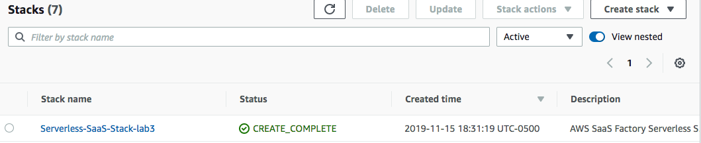</p>

<b>Step 3</b> - <b>You must confirm that the lab3 CloudFormation stack has completed successfully before continuing</b>. We will now update our React client to use the new endpoints created as part of above CloudFormation stack. Update your website by running following commands:
```
cd /home/ec2-user/environment/saas-factory-serverless-workshop/resources
sh website-lab3.sh
```

<b>Step 4</b> - Just like at the end of Lab 2, the website deployment script will trigger a CloudFront cache invalidation. We must wait for the invalidation to complete before we can continue. Go to the CloudFront service in the console. Click on the distribution for this workshop as you have before and then click on the <b>Invalidations</b> tab. Wait until the listed invalidation shows a <b>Status</b> of <b>Completed</b>.

<p align="center"></p>

<b>Step 5</b> – Now we can go verify that our new Order service has been deployed. Open the Lambda service within the AWS console. You'll be presented with a list of all of your functions. Enter <b>saas-factory-srvls-wrkshp-orders</b> into the filter box above the list of functions to narrow this list to those that we've deployed. Here you'll notice that there are separate functions for each of the operations of our Order service. Each one corresponds to a REST operation (GET, PUT, DELETE, etc.). This confirms that our service has been deployed.

<p align="center">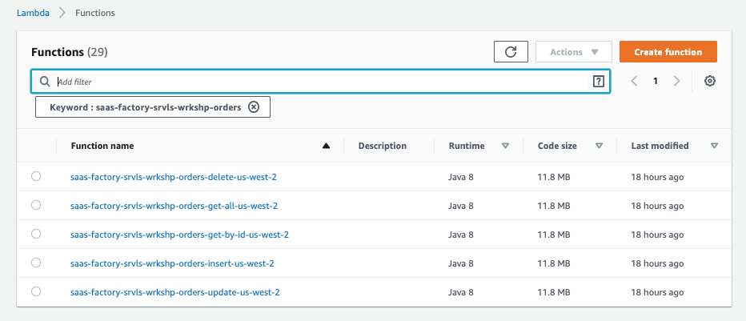</p>

<b>Step 6</b> – The functions are in place. Now we need to verify that the API Gateway has mapped an entry to these functions to route traffic to this serverless microservice (instead of the monolith we were using before). Navigate to the API Gateway service in the AWS console. Select the <b>saas-factory-srvls-wrkshp-lab3</b> API from the list. This should display a list of resources that are configured for this API that appears as follows:

<p align="center">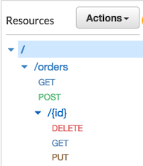</p>

Here you'll see the basic CRUD operations that are enabled as resources in our API Gateway. There are GET and POST resources which don't require parameters. There is also a /{id} route that adds an identifier to the resource to enable GET, DELETE, and PUT operations on individual orders.

<b>Step 7</b> – Now we can verify that these REST resource methods are mapped entry to these functions to route traffic to this serverless microservice (instead of the monolith we were using before). Select the <b>GET</b> method under the <b>/orders</b> resource to access the configuration for the GET orders operation. You will see that this method shows <b>LAMBDA_PROXY</b> for the Integration Request type. This will display a view similar to the following:

<p align="center"></p>

<b>Step 8</b> – Finally, we can verify which that the correct Lambda function is the one being proxied. Select the <b>Integration Request</b> title from the top of the box at the right. This will display a view similar to the following:

<p align="center">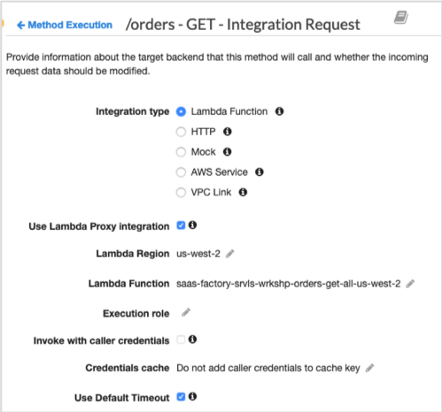</p>

The key piece of information here is the Lambda Function. The value for this attribute should map directly to our getOrders() Lambda function that we deployed earlier. The function will be named <b>saas-factory-srvls-wrkshp-orders-get-all-[REGION]</b>.

<b>Step 9</b> – We've confirmed that our API Gateway and Lambda functions appear to have landed and been configured correctly. Now let's go perform an operation in the application to verify that these new functions are working. We intentionally didn't carry forward any data for the Order Service from our monolith database so we're starting with an empty database.

Open the application using the URL you've previously saved for your modern application and sign-in with one of the tenants you're previously created. Before we can add an order to our system, we must have at least one product in our catalog. Click on the <b>Products</b> link in the navigation header to confirm that you have a product. If you do not have any products, add one now.

<b>Step 10</b> - Now, navigate to the <b>Orders</b> menu item in the navigation header and select <b>Add Order</b> from the page that is displayed. Fill out the form that is displayed with some mock order information and save the order by selecting the <b>Add Order</b> button. Oops! What happened? Let's go take a look at our Order service to see what went wrong.

<p align="center">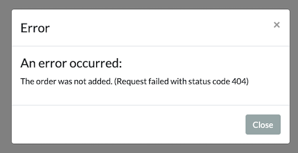</p>

<b>Step 11</b> – Let's start by examining the code of our Order service. Open the Cloud9 IDE in the AWS console and select the <b>Serverless SaaS Workshop IDE</b>. Using the file tree in the left-hand window pane, open the <b>lab3/order-service/src/main/java</b> path to see the different classes that make up the Order service. Double-click on the <b>OrderService.java</b> file to view its contents and locate the <b>insertOrder</b> menthod within the Java class. The function will appear as follows:

```java
public APIGatewayProxyResponseEvent insertOrder(Map<String, Object> event, Context context) {
    LOGGER.info("OrderService::insertOrder");

    APIGatewayProxyResponseEvent response = null;
    Order order = fromJson((String) event.get("body"));
    if (order == null) {
        response = new APIGatewayProxyResponseEvent()
                .withStatusCode(400);
    } else {
        // TODO Add code to call DAL.insertOrder here and return a 200
        response = new APIGatewayProxyResponseEvent()
                .withStatusCode(404)
                .withHeaders(CORS);
    }
    return response;
}
```

In looking at this function more closely, you'll discover that the function isn't actually finished. There's a to-do note saying we need to call the data access layer to actually save the order object. Currently, the method is returning an HTTP 404 error.

<b>Step 12</b> – To get our insertOrder() method working, we'll need to add the code that inserts an order into the database. Copy and paste the following code so your insertOrder method matches.

```java
public APIGatewayProxyResponseEvent insertOrder(Map<String, Object> event, Context context) {
    LOGGER.info("OrderService::insertOrder");

    APIGatewayProxyResponseEvent response = null;
    Order order = fromJson((String) event.get("body"));
    if (order == null) {
        response = new APIGatewayProxyResponseEvent()
                .withStatusCode(400);
    } else {
        order = DAL.insertOrder(event, order);
        response = new APIGatewayProxyResponseEvent()
                .withStatusCode(200)
                .withHeaders(CORS)
                .withBody(toJson(order));
    }
    return response;
}
```

This code extracts the order data from our incoming request. If the order is empty, we return with an Invalid Request status code of 400. Otherwise, we call our data access layer (DAL) to insert the order into the database and return a status code of 200.

<b>Step 13</b> – Be sure to save your changes with the Ctrl-S keyboard shortcut or by selecting <b>Save</b> from the <b>File</b> menu in Cloud9. With our new code introduced, we now need to deploy this updated function to the Lambda service. Run the following commands to invoke this update:

```
cd /home/ec2-user/environment/saas-factory-serverless-workshop/lab3/order-service/
sh update-service.sh 
```

<b>Step 14</b> – The updated version of our insertOrder() function is now in place. Let's go open the application again (using the URL you retrieved earlier), login using the tenant you had used earlier, and access the <b>Orders</b> item in the menu. Select the <b>Add Order</b> button from the page and enter an order into the form that is displayed. When you are done entering the order select the <b>Add Order</b> button from the form. You should now see that your order appears in the list of orders on the page, confirming that our fix appears to have worked.

<p align="center">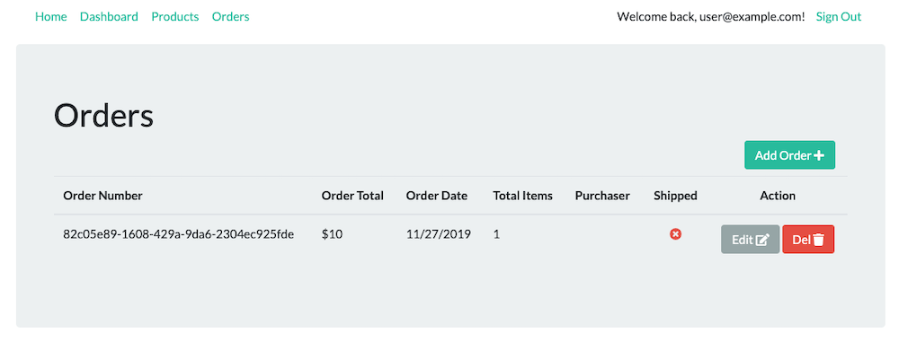</p>

<b>Step 15</b> – As part of moving to this new microservice, we also had to remove our dependency on the database monolith where orders had previously been shared in one large database used by all services. Extracting this data from the monolith is essential to our microservices story. Each of our microservices must own the data that it manages to limit coupling and enable autonomy. When we move this data out of the monolith, it also gives us the opportunity to determine what service and multi-tenant storage strategy will best fit the multi-tenant requirements of our microservice. 

In this case, we're looking at how we want to represent our order data that will be managed by our order management microservice. Should we silo the data for each tenant? Should it be pooled (share a common table/database)? What are its isolation requirements? These are all questions we need to answer. For this solution, we've decided to move the order data to DynamoDB and use a NoSQL representation. However, for isolation reasons, we've opted to put the data in separate tables for each tenant. Below is a conceptual model of the data representation for the order service:

<p align="center">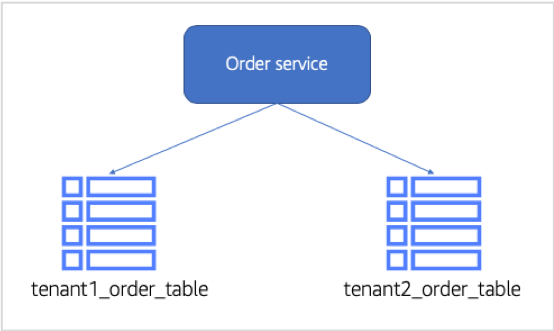</p>

To see this in action, let's now go look at the data that was added via our new order microservice. Navigate to the DynamoDB service in the AWS console and select the <b>"Tables"</b> item from the navigation pane on the left. This will display a list of DynamoDB tables, including any tables for any tenant that have orders. Below is a sample that includes a few tenants table that were created:

<p align="center">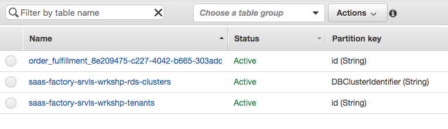</p>

You'll see that there are two tables here, one for each tenant in our system. Your list of tables will vary based on the tenants you've introduced. 

<b>Step 16</b> – Now we need to verify that the order we created landed in a DynamoDB table. Select the table named <b>order_fulfillment_[TENANT_ID]</b>. Once you select your table, you'll get a view with a list of tabs with information about your table. Select the <b>Items</b> tab to view the list of the items in that table. The view will be similar to the following:

<p align="center">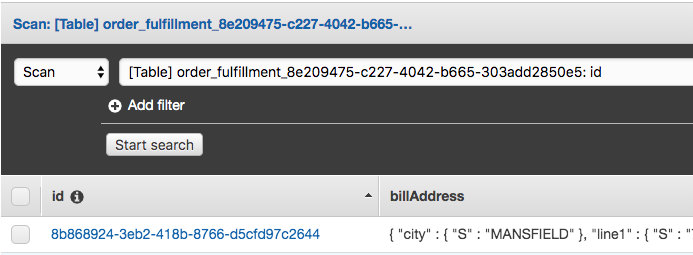</p>

In this example, our table had one order item. You can drill into any item in this list to get more detail on that item.

<b>Step 17</b> – This tenant-per-table partitioning model uses the context of the current tenant identifier (passed in the JWT token) to generate our table name. Let's look at how this is resolved in the code of our application service. Go back to the files for the lab 3 order service in Cloud8. Open the Cloud9 IDE in the AWS console and select <b>Serverless SaaS Workshop IDE</b>. Using the file tree in the left-hand window pane, open the <b>lab3/order-service/src/main/java</b> path to see the different classes that make up the Order service. Double-click on the <b>OrderServiceDAL.java</b> file and look at the <b>insertOrder()</b> method. The code will appear as follows:

```java
public Order insertOrder(Map<String, Object> event, Order order) {
    UUID orderId = UUID.randomUUID();
    LOGGER.info("OrderServiceDAL::insertOrder " + orderId);
    order.setId(orderId);

    try {
        Map<String, AttributeValue> item = DynamoDbHelper.toAttributeValueMap(order);
        String tableName = tableName(event);

        PutItemResponse response = ddb.putItem(request -> request.tableName(tableName).item(item));
    } catch (DynamoDbException e) {
        LOGGER.error("OrderServiceDAL::insertOrder " + getFullStackTrace(e));
        throw new RuntimeException(e);
    }

    return order;
}
```

Within this method, you'll see a call to a helper method called <b>tableName</b>, supplying the context of the request in the <b>event</b> parameter. This event parameter contains our JWT token with our tenant context.

Let's look at this implementation of tableName. Scroll down in the OrderServiceDAL.java file until you find the implementation for the tableName method. The code is as follows:

```java
private String tableName(Map<String, Object> event) {
    String tenantId = new TokenManager().getTenantId(event);
    String tableName = "order_fulfillment_" + tenantId;
    
    if (!tenantTableCache.containsKey(tenantId) || !tenantTableCache.get(tenantId).equals(tableName)) {
        boolean exits = false;
        ListTablesResponse response = ddb.listTables();
        for (String table : response.tableNames()) {
            if (table.equals(tableName)) {
                exits = true;
                break;
            }
        }
        if (!exits) {
            CreateTableResponse createTable = ddb.createTable(request -> request
                    .tableName(tableName)
                    .attributeDefinitions(AttributeDefinition.builder().attributeName("id").attributeType(ScalarAttributeType.S).build())
                    .keySchema(KeySchemaElement.builder().attributeName("id").keyType(KeyType.HASH).build())
                    .provisionedThroughput(ProvisionedThroughput.builder().readCapacityUnits(5L).writeCapacityUnits(5L).build())
            );
            waitForActive(tableName);
        }
        tenantTableCache.put(tenantId, tableName);
    }

    return tenantTableCache.get(tenantId);
}
```

You'll notice that the very first thing this code does is make a call to the TokenManager to get our current tenant identifier from the supplied JWT token. It then creates and table name that is the concatenation of <b>order_fulfillment_</b> and the tenant id we retrieved. This ensures that each table name is unique for each tenant. If a DynamoDB table with that name doesn't yet exist, one is created on-the-fly.

<b>Step 18</b> – In order to simplify our ability (for this lab) to identify activity for tenant, we're going to add a bit of logging detail to our order service to include this information. Scroll back up to the insertOrder() method in our OrderServiceDAL.java file. Let's add a logging statement after retrieving the table name for the current tenant. Add this line to your method right after calling the tableName method and right before getting the PutItemResponse from DynamoDB.

```java
LOGGER.info("OrderServiceDAL::insertOrder TableName = " + tableName);
```

Your insertOrder method should look similar to this:

<p align="center">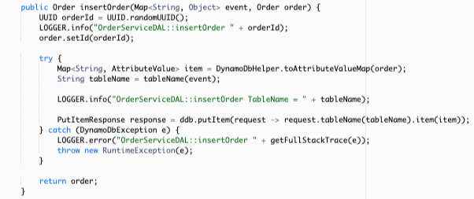</p>

<b>Step 19</b> – Be sure to save your changes with the Ctrl-S keyboard shortcut or by selecting <b>Save</b> from the <b>File</b> menu in Cloud9. With our new code introduced, we now need to deploy this updated function to the Lambda service. Run the following commands to invoke this update:

```
cd /home/ec2-user/environment/saas-factory-serverless-workshop/lab3/order-service/
sh update-service.sh 
```

<b>Step 20</b> – The last step in validating our change is to run the actual application and verify that our new logging call is recording the tenant table name. Open the application (using same CloudFront URL as before), sign-in with your credentials, and access the Orders link at the top of the page. Select the <b>Add Order</b> button from the orders page and enter a new order into the form. Now select <b>Add Order</b> on the new order form to save the order.

<b>Step 21</b> – Finally, to see the impact of our change, we'll need to view the log files for our function. Open the CloudWatch service in the AWS console and select <b>Log groups</b> from the navigation pane on the left of the page. This will display a list of multiple log groups. To narrow the list, enter <b>/aws/lambda/saas-factory-srvls-wrkshp-orders-insert</b> into the filters box at the top of the function list. Now, select the function name shown in the list. This will display a list of log streams for the selected function that will be similar to the following:

<p align="center">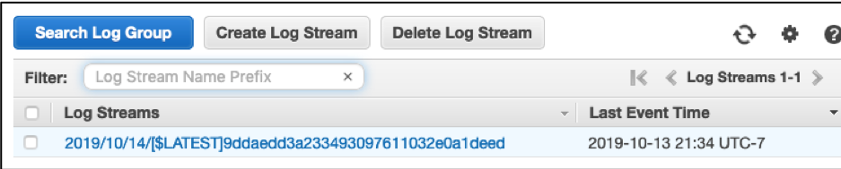</p>

<b>Step 22</b> – Click on the top log stream to access the log file contents. Once you're in the log, you'll need to search for your newly inserted log file. Ultimately, you will be able to locate the DynamoDB table name that was associated with the order creation that you performed.

<p align="center">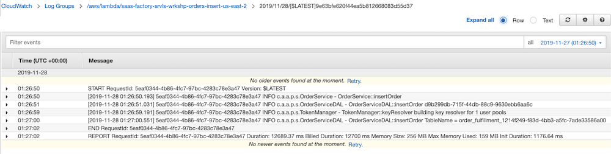</p>

## Review
This lab represented a key next step in our migration process. We now started the gradual move to decompose our monolith into microservices. The key element of this model is our ability to run these new microservices side-by-side with code that remains in our monolith. In this scenario, we separated out the Order service, moving it to a serverless microservice. We also moved the data it manages over to the new environment. Our API Gateway was then setup to direct traffic selective to the microservice or the monolith (depending on which functionality was being accessed). 

You have now completed Lab 3. 

[Continue to Lab 4](../lab4/README.md)