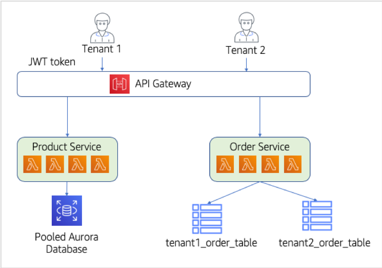
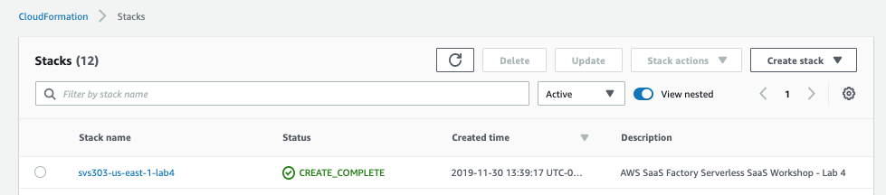
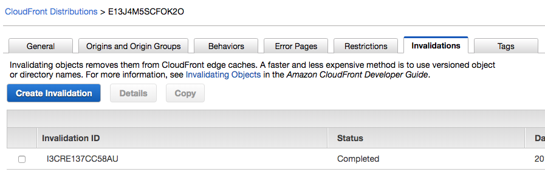
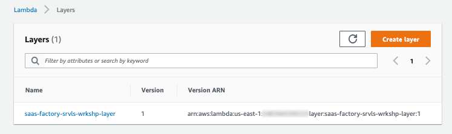
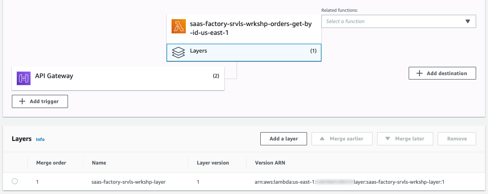
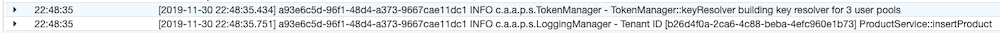
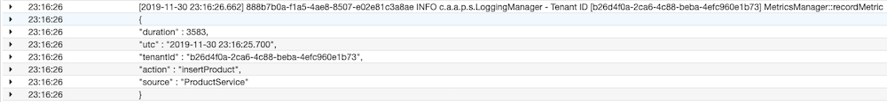

# Lab 4 – Extracting the Remaining Service - Goodbye Monolith!

At this stage, our migration to serverless SaaS is well underway. We have introduced onboarding, identity, and a model that supports side-by-side support for our new multi-tenant microservices and the existing monolith. For many organizations, this represents a key stage in their migration. Having created a microservice and demonstrated that this two-pronged approach can work, you can now focus your energy on carving out more and more services until the monolith is no longer needed.

In a real-world scenario, this transition would be a somewhat involved process where you would need to invest significant time to slowly migrate your business logic and data to a microservices model. However, we've limited the functionality of our sample monolith so that we can demonstrate what it would look like to migrate the remaining bits of functionality and completely eliminate the need for the monolith application tier.

To extract the final bits of functionality out of our monolith, we'll need to move the product service out to a standalone microservice. This will mimic much of what we discussed above. However, now that we have multiple microservices, we will also need to think about what it will mean to have code and concepts that are common to both of our microservices. We'll also look at another data partitioning model for this service, having our data represented in a relational database that can store data for all tenants in a shared construct (using what we call a <b>pool</b> model).

The architecture at this stage is much simpler. Gone is the need to provision full monolith stacks each time a tenant onboards. Instead, our tenants now all share the serverless microservices that can scale on their own and do not require separate provisioning for each tenant. The diagram below provides a high-level view of the new architecture:

<p align="center"></p>

This diagram represents the completion of our migration process, highlighting that the functionality of our system is now supported by an API Gateway and two logical microservices (which are a composite of multiple Lambda functions).

## What You'll Be Building

The lab is all about getting your solution moved away from the monolith. The basic elements of making this final migration are as follows:
*	We'll extract our last service from the monolith, the product service. This service will mostly move in the same fashion as the order service did in Lab 3. We will start with deploying the new Lambda functions for the serverless version of the product service.
*	Now that we have a second service, we can see that we need some way to extract and share core concepts that span our services. In the universe of serverless, we can achieve this through the use of Lambda layers. Layers provide a mechanism for Lambda functions to access shared code that can be deployed and versioned separately from the function itself. We'll move our existing token management code from the order service to a layer so we can share it between both the order and product services and we'll create new multi-tenant aware logging and metrics libraries and add those to our layer.
*	Once we have these common concepts in our layers, we'll want to go back to our product and order services and add the instrumentation to use the code in these layers. We'll update our logging and and add some metrics instrumentation to illustrate how these new mechanisms remove all awareness of tenant context from developers.
*	As part of moving our service over, we also have to consider how we want to represent the product data. In this case, we'll use a <b>pool</b> model for the data where the tables in our relational database will hold the data for all tenants in a shared construct. A column in the table will be used to discriminate the data by tenant identifier.

Once these steps are completed, we'll have the core elements of our migration completed. We'll also have layers in place that will simplify the introduction of new services as we move forward. 

## Step-By-Step Guide
The following is a breakdown of the step-by-step process for building out our new shared layers and moving the Product service from our monolith to a serverless microservice:

<b>Step 1</b> - Let's deploy our new product microservice. As before, we have a script to execute which will build and upload all the pieces required for our Lambda functions and then kick off a CloudFormation stack to provision everything. Run the following commands in the terminal windows of your Cloud9 IDE to launch this script:
```
cd /home/ec2-user/environment/saas-factory-serverless-workshop/resources
sh lab4.sh
```

This will trigger a cloud formation stack creation. <b>Before proceeding make sure that lab4 stack has been created successfully as follows</b>:

<p align="center"></p>

<b>Step 2</b> - <b>You must confirm that the lab4 CloudFormation stack has completed successfully before continuing</b>. We will now update our React client to use the new endpoints created as part of above CloudFormation stack. Update your website by running following commands:
```
cd /home/ec2-user/environment/saas-factory-serverless-workshop/resources
sh website-lab4.sh
```

<b>Step 3</b> - Just like at the end of Lab 3, the website deployment script will trigger a CloudFront cache invalidation. We must wait for the invalidation to complete before we can continue. Go to the CloudFront service in the console. Click on the distribution for this workshop as you have before and then click on the <b>Invalidations</b> tab. Wait until the listed invalidation shows a <b>Status</b> of <b>Completed</b>.

<p align="center"></p>

<b>Step 4</b> – Now that we have a second microservice that will be moving into our architecture, we need to start thinking about how we can move common mechanisms that have tenant-context to a reusable mechanism. We could certainly use libraries and frameworks to do this. The question is, how do we make them reusable across our services? This is where Lambda layers come in. With layers we can separately deploy and version shared code that will support our need to hide away the details of multi-tenancy. We will start with some code we've already been using in our order service from Lab 3. We can now move the token manager class out of the order service and into a shared layer.

The role of the token manager is to simplify acquiring the tenant identifier from the supplied JWT token. Layers allow our separate Lambda functions to follow software engineering best practices. This class is imported by the other classes in the layer to expand their functionality while minimizing code duplication. In your Cloud9 environment navigate to <b>lab4/layers/serverless-saas-layer/src/main/java/</b> and, inside the series of folders defining the Java package name, open <b>TokenManager.java</b> by double-clicking it. A portion of the code for this class is shown below. 

```java
private static final String TENANT_CLAIM = "custom:tenant_id";

public String getTenantId(Map<String, Object> event) {
    String bearerToken = ((Map<String, String>) event.get("headers")).get("Authorization");
    String jwtToken = bearerToken.substring(bearerToken.indexOf(" ") + 1);
    Claims verifiedClaims = Jwts.parser()
            .setSigningKeyResolver(keyResolver())
            .parseClaimsJws(jwtToken)
            .getBody();

    String tenantId = verifiedClaims.get(TENANT_CLAIM, String.class);

    if (tenantId == null) {
        throw new RuntimeException("No tenant id in token");
    }

    return tenantId;
}
```

The token manager extracts the bearer token from the Authorization header of the request event. It then decrypts the signed token and unpacks all of the claims (name/value pairs) embedded in the JWT. Once the token is unpacked, we get the tenant id from its claims by using the custom claim defined by our identity provider (Cognito in this case) and return this value.

<b>Step 5</b> -  With the token manger in place, we can start to introduce the other layer code that will reference the token manager. The first of these will be the logging manager. By moving our logging code to a layer, we can simply make logging calls and have the logging manager inject the tenant context. Not complicated, but good at hiding away tenant details from developers. Open the <b>LoggingManager.java</b> file in Cloud9 by double-clicking it. A portion of the code for this class is shown below.

```java
public static void info(Map<String, Object> event, String message) {
    LOGGER.info(decorateMessage(event, message));
}

private static String decorateMessage(Map<String, Object> event, String message) {
    return "Tenant ID [" + new TokenManager().getTenantId(event) + "] " + message;
}
```

Notice that our LoggingManager depends on the TokenManager to extract the tenant id from the incoming request. Our new LoggingManager will ensure that all of our log messages always include tenant context which will help with monitoring and debugging of our multi-tenant system. 

<b>Step 6</b> – The last item we're going to add to our layer is a metrics manager. This helper is used to publish metrics data with tenant context. Recording and publishing metrics is essential to SaaS organizations. Although what we have here is rather simple and lightweight, we wanted to show the importance of adding tenant-aware metrics to your SaaS solutions. Open the <b>MetricsManager.java</b> file to see the simple metrics manager we've created for this workshop. A portion of the code for this class is shown below.

```java
public static void recordMetric(Map<String, Object> event, String source, String action, Long duration) {
    String tenantId = new TokenManager().getTenantId(event);

    Map<String, Object> metric = new HashMap<>();
    metric.put("tenantId", tenantId);
    metric.put("source", source);
    metric.put("action", action);
    metric.put("duration", duration);
    metric.put("utc", Instant.now().truncatedTo(ChronoUnit.MILLIS).toString().substring(0, 23).replace('T', ' '));

    String json;
    try {
        json = MAPPER.writerWithDefaultPrettyPrinter().writeValueAsString(metric);
    } catch (JsonProcessingException e) {
        LoggingManager.error(event, getFullStackTrace(e));
        json = e.getMessage();
    }
    
    LoggingManager.log(event, "MetricsManager::recordMetric\n" + json);
}
```

This code also utilizes the TokenManager to help build the data for each metric. Our metric is a simple execution time for a given source and action. We will send this metric data to a log file for this workshop, but you can imagine how you'd integrate this with a data collection pipeline using tools such as Amazon SQS or Amazon Kinesis Data Firehose.

<b>Step 7</b> – You may be wondering why we're putting all 3 of our helpers into a single layer. Why not separate them into their own layers? While it is tempting to keep functionality separate, there is a relatively low limit to how many layers you can have per Lambda function. It is best practice to package your layer code as needed to stay under the limit.

The deployment script you ran at the beginning of this lab deployed our layer and wired it up to the product service Lambda functions. The order service functions, however, were deployed as a step in the previous lab. Now that we've reviewed our multi-tenant layer code, we need to update our order service to take advantage of it. Enter the following commands in the terminal window of the Cloud9 IDE to configure our order service functions to use the new layer:
```
cd /home/ec2-user/environment/saas-factory-serverless-workshop/lab4/order-service
sh update-layers.sh
```

<b>Step 8</b> – To verify that our layers were successfully deployed, let's open the Lambda service in the AWS console. Once the Lambda page is open, select the <b>Layers</b> option from the left-hand side of the page. This will display a list of layers that should include our multi-tenant token, logging and metrics code. The view will appear as follows:

<p align="center"></p>

<b>Step 9</b> - We should confirm that the layer has been integrated with our functions. Click on the <b>Functions</b> link in the left hand menu of the Lambda service console. Enter <b>saas-factory-srvls-wrkshp-orders</b> into the filter box above the list of functions to narrow this list. Select any of the order service functions to open the detail page for the function. In the <b>Designer</b> section, click on the <b>Layers</b> icon under the function name and you'll see that our layer has been merged with the function.

<p align="center"></p>

<b>Step 10</b> – It's time to look at our new serverless version of our product service. Migrating the product service was the last part of breaking up the monolith. This required both creating a multi-tenant version of the service as well as the database. Let's start with the service code. In Cloud9, open <b>lab4/product-service/src/main/java</b> and, inside the series of folders defining the Java package name, open <b>ProductService.java</b> by double-clicking it. You'll see that this class underwent a similar transition from the monolith REST API controller class from Lab 2 as the order service did. This class contains the various methods that implement the GET, PUT, POST, and DELETE methods for our product service - each of which will be deployed as a separate Lambda function to make up our logical product service. Here's a snippet of the code.

```java
public APIGatewayProxyResponseEvent getProducts(Map<String, Object> event, Context context) {
    LoggingManager.log(event, "ProductService::getProducts");
    List<Product> products = DAL.getProducts(event);
    APIGatewayProxyResponseEvent response = new APIGatewayProxyResponseEvent()
            .withStatusCode(200)
            .withHeaders(CORS)
            .withBody(toJson(products));
    return response;
}
```

The code in this service and the order service have both been updated to take advantage of our new shared Lambda layer. The main difference visible is the change to our logging calls. Where our prior version called a static class logger with a message, our new product and order services now call our <b>LoggingManager</b> from the layer, supplying the <b>event</b> from the incoming request that contains the JWT token.

<b>Step 11</b> – We also migrated the database for the product service from the single-tenant monolith representation to our microservice model. As we did with the Order service, we must consider how the Product service will want to represent its data in a multi-tenant model. This means thinking about performance, isolation, and so on. We decided that, for products, we'd demonstrate another flavor of data partitioning, using a <b>pooled</b> model where the data for tenants would co-exist in the same tables of a relational database (isolated by a column with a tenant identifier). This means that our service will use the same database for all tenants and won't require us to provision new tables or other constructs as new tenants are introduced.

In many respects, the code for interacting with the multi-tenant database does not change that much from the silo version (since they were both working against a relational database and the schema is mostly unchanged). Let's look at some SQL code that illustrates the minor tweaks that are needed to move from our monolith database to our pooled, multi-tenant representation. Open <b>ProductServiceDAL.java</b> in Cloud9 by double-clicking on the filename. Here are a couple of lines from that file.

```java
private final static String INSERT_PRODUCT_SQL = "INSERT INTO product (tenant_id, sku, product, price) VALUES (?, ?, ?, ?)";
private final static String SELECT_CATEGORY_SQL = "SELECT category_id, category FROM category WHERE tenant_id = ?";
```

These statements show how we have to add reference to a <b>tenant_id</b> column when we query the shared database to partition the data between our multiple tenants.

<b>Step 12</b> – To confirm that our service is actually running in a multi-tenant fashion, let's verify that the data partitioning and the logging messages that we've focused on are landing where we expect. Re-open the application (using the same CloudFront URL we captured above). Be sure to <b><i>refresh your browser</i></b> to force it to pull down a new copy of our React app.

Sign-in to the application and select the <b>Products</b> link from the navigation at the top of the page. Now select the <b>Add Product</b> button and enter new product information into the Add Product form. When you finish, select the <b>Add Product</b> button at the bottom of the form to save the new product information.

<b>Step 13</b> – Open the CloudWatch service in the AWS console and select <b>Log groups</b> from the menu on the left. Enter <b>/aws/lambda/saas-factory-srvls-wrkshp-products-insert</b> in the <b>Filter</b> box at the top of the screen and select the most recent Log Stream. If you look closely, you'll see log entries from our LoggingManager prefixed with the tenant id. You will also see log entries that did not use our tenant-aware logger and they will lack the tenant id prefix.

<p align="center"></p>

<b>Step 14</b> - As a final activity for this workshop, let's exercise our tenant-aware MetricsManager. Back in Cloud9, open <b>ProductService.java</b> and navigate to the <b>insertProduct</b> method. We'll wrap the lines of the method with some simplistic timing code and then submit that data to our MetricsManager. Your insertProduct method should look like the following.

```java
public APIGatewayProxyResponseEvent insertProduct(Map<String, Object> event, Context context) {
    long startTimeMillis = System.currentTimeMillis();

    LoggingManager.log(event, "ProductService::insertProduct");
    APIGatewayProxyResponseEvent response = null;
    Product product = productFromJson((String) event.get("body"));
    if (product == null) {
        response = new APIGatewayProxyResponseEvent()
                .withStatusCode(400);
    } else {
        product = DAL.insertProduct(event, product);
        response = new APIGatewayProxyResponseEvent()
                .withStatusCode(200)
                .withHeaders(CORS)
                .withBody(toJson(product));
    }

    long totalTimeMillis = System.currentTimeMillis() - startTimeMillis;
    MetricsManager.recordMetric(event, "ProductService", "insertProduct", totalTimeMillis);
    
    return response;
}
```

Be sure to save your changes using the Ctrl-S keyboard shortcut or selecting <b>Save</b> from the <b>File</b> menu in Cloud9.

<b>Step 15</b> - Now we need to redeploy our product service. Enter the following commands to rebuild and deploy our Lambda functions.

```
cd /home/ec2-user/environment/saas-factory-serverless-workshop/lab4/product-service
sh update-service.sh
```

<b>Step 16</b> - Return to the application using the same URL as before and add a new product.

<b>Step 17</b> - The addition of the new product should have triggered our MetricsManager layer feature. Let's go to CloudWatch in the AWS console and see if we can find it. Again, select <b>Log groups</b> from the menu on the left and enter <b>/aws/lambda/saas-factory-srvls-wrkshp-products-insert</b> in the <b>Filter</b> box at the top of the screen and select the most recent Log Stream. You should find a log entry with a metric data packet (formatted in JSON) similar to the following.

<p align="center"></p>

## Review
This lab was the final step in our move away from the monolith. We moved the last bit of the monolith, the Product service, to a serverless microservice. This eliminated our need to route between the monolith and the microservices and left the system in a fully multi-tenant model. As part of this move, we also took measures to standardize our approach to implementing multi-tenant microservices, introducing layers that would be used to centralize the logging, metrics, and token management that is used by all microservices in our system.
